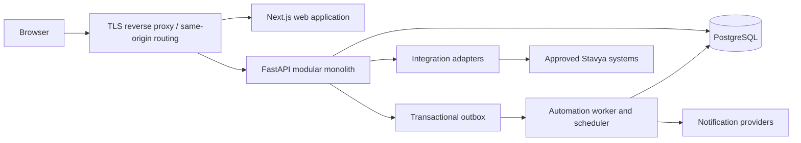
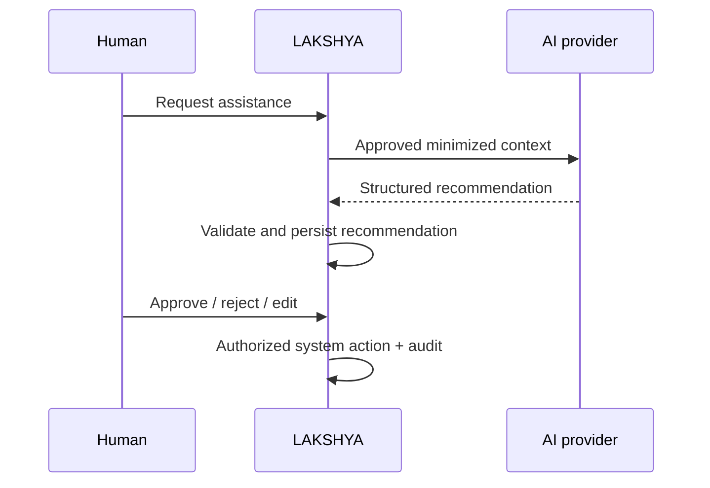

# LAKSHYA V0.1 System Architecture

**Status:** Reconciled with approved Stavya V0.1 business rules; unresolved items remain marked
**Scope:** Architecture only; no implementation is authorized by this document.

## 1. Architectural goals

LAKSHYA is an organizational execution system, not a generic task tracker. The architecture preserves `Quarterly Direction -> Monthly Priority -> Weekly Milestone -> Commitment -> Task -> Outcome`, `Meeting -> Decision -> Commitment -> Task`, `O&O -> planning/execution work`, and `Stuck/Need -> Escalation -> Resolution` as traceable domain relationships.

V0.1 should be secure, auditable, inexpensive to operate, and easy for a small team to change. It should create extension seams for automation, integrations, AI assistance, and management intelligence without deploying those future capabilities now.

## 2. Architecture style

Use a **modular monolith** with independently deployable web, API, and worker processes from two application codebases:



The API owns business rules and all authorization decisions. The web client never writes directly to the database. The worker executes deterministic, versioned automation asynchronously. PostgreSQL is the system of record.

Microservices are rejected for V0.1: the domain boundaries are still being validated, distributed transactions would weaken auditability, and independent scaling does not yet justify the operational cost.

## 3. Domain modules

The backend is divided by business capability, with explicit module interfaces:

- Identity and access: organizations, departments, users, roles, permissions, sessions.
- Strategy: quarterly directions, objectives, monthly priorities and weekly milestones.
- Meetings: meetings, participants, decisions and approval.
- Execution: commitments, tasks, RACI, dependencies and outcomes.
- Attention: stuck/need items, escalation cases and decisions required.
- Engagement: notifications and user notification state.
- Automation: domain events, rules, scheduled evaluation and action execution.
- Audit: append-only security and business audit events.
- Reporting: read-only dashboard projections and management queries.
- Integrations: inbound/outbound adapters and external identity mapping.

O&O is a recognized source of Objectives, Priorities, Milestones, Commitments, Tasks and future Improvement Actions. V0.1 stores source provenance and links; it does not implement the complete O&O workflow.

Modules may share one database in V0.1, but may not bypass another module's service layer to mutate its records. Cross-module work occurs in one application transaction when synchronous, or through an outbox event when asynchronous.

## 4. Frontend architecture

Use Next.js with TypeScript, Tailwind CSS and shadcn/ui. Prefer server-rendered pages for initial loading and accessibility; use client components only for interactive workflows. Organize code by feature rather than by technical file type. A generated or hand-maintained typed API client is the only data-access boundary.

The frontend may hide unavailable actions for usability, but server-side authorization remains authoritative. Treat server data as untrusted until validated at the API boundary. Use a shared design-token layer, accessible components, route-level error boundaries, and explicit loading/empty/error states.

Do not place business transition logic, permission truth, escalation calculations, or audit construction in the browser. Dashboard pages consume purpose-built summary endpoints rather than downloading all tasks.

## 5. Backend architecture

Use FastAPI, Python, Pydantic and SQLAlchemy 2.x. Within each module separate:

1. API schemas and route handlers.
2. Application use cases and authorization checks.
3. Domain policies and state transitions.
4. SQLAlchemy repositories and external adapters.

Route handlers perform transport concerns only. Use cases establish the transaction, load scoped entities, check permissions and invariants, mutate state, append audit data and outbox events, then commit atomically. Pydantic request schemas are distinct from persistence models and response schemas.

Use synchronous or asynchronous SQLAlchemy consistently after a measured prototype; do not mix styles casually. Long-running work, provider calls and bulk summaries must not execute inside request transactions.

## 6. Database architecture

PostgreSQL is the authoritative relational store. Use UUID primary keys, `timestamptz` in UTC, explicit foreign keys, check/unique constraints, and normalized tables for critical relationships. JSONB is allowed for audit snapshots, provider payloads and versioned rule conditions, but not as the sole representation of RACI, ownership, dependencies, or the execution hierarchy.

All tenant-owned records carry `organization_id`; department-scoped records also carry an owning `department_id` where the business concept has one. V0.1 is one Stavya organization, but this boundary prevents later redesign and supports safe query scoping. Details are in [DATABASE.md](./DATABASE.md).

## 7. Authentication

V0.1 uses first-party credentials behind an authentication service abstraction, with a future OpenID Connect adapter. Passwords are hashed with Argon2id. On successful login, issue a high-entropy opaque session identifier in a `Secure`, `HttpOnly`, `SameSite=Lax` cookie. Store only a hash of the token server-side, with user, organization, expiry, last activity and revocation metadata.

State-changing cookie-authenticated requests require CSRF protection and Origin/Referer validation. Rotate the session at login and privilege change; revoke it on logout, password reset, account disablement, or security response. Do not store bearer tokens in browser local storage.

Enterprise identity/SSO is a deployment decision: `REQUIRES BUSINESS DECISION` before authentication implementation is finalized.

## 8. Authorization

Use RBAC plus resource scope and relationship checks:

```text
allow = permission granted by active role
    AND organization scope matches
    AND department/resource scope permits access
    AND domain invariant permits the transition
```

Permissions are stable action strings such as `task.create`, `task.assign`, and `audit.read`. Roles map permissions to a scope. Record-level checks account for participant, RACI, assignee, creator and department relationships. Every protected use case checks authorization server-side; list queries apply scope in SQL to prevent data leakage. See [RBAC.md](../business-rules/RBAC.md).

Approved boundaries are enforced independently of the unresolved full matrix: an Stavyan may create/assign a Task only to themself; a Manager may assign within authorized team scope; a Department Head may assign within authorized department scope; and MD Office may create/assign organization-wide within authorized scope. Stavyans cannot change official organizational deadlines or organizational priority, cannot directly reopen a formally completed Commitment, and may complete only normal assigned Tasks. Formal Commitment completion requires its Accountable person or another authorized approver.

## 9. Automation

Domain mutations write business data, an audit event and an outbox event in the same transaction. A worker claims outbox/scheduled jobs, evaluates the exact active rule version, executes idempotent actions, and records attempts and outcomes. V0.1 uses a PostgreSQL-backed outbox/job table; a message broker may replace the transport later without changing event contracts.

Automation may remind, notify, generate a draft commitment from an approved decision, and evaluate configured escalation rules. It may not invent management policy or perform AI-authoritative changes. See [AUTOMATION.md](./AUTOMATION.md).

## 10. Notifications

Notifications are consequences of domain events, never substitutes for domain state. V0.1 should implement an in-app inbox; email is an optional adapter after provider and data-governance approval. A notification contains event context, recipient, template/version, delivery channel, delivery state, deduplication key and link to the relevant entity. Preferences cannot suppress mandatory security or escalation notices where policy marks them mandatory.

Escalation creation and notification delivery are separate: provider failure does not roll back the escalation. Retries are bounded and auditable; permanent failures enter an operational review queue.

## 11. Audit architecture

Audit events are append-only and separate from operational history/comments. Each event records organization, actor (or system), action, entity type/id, timestamp, source, request/correlation ID, reason where required, and redacted before/after values. Audit creation is atomic with the business mutation. Application roles cannot update or delete audit rows.

At minimum, owner, deadline, priority, RACI, status, completion, reopening, escalation, decision and Commitment changes are audited with previous/new values where applicable. Monthly Priority changes during the month preserve history rather than overwriting it without evidence.

Sensitive values, password material, session tokens and secrets must never enter audit payloads. Audit access is itself audited. Retention and export policy are `REQUIRES BUSINESS DECISION`.

## 12. Future AI boundary

AI is an external advisory subsystem behind an `AIProvider` port. It consumes explicitly approved, minimized context and produces a persisted recommendation containing provenance, model/prompt version, confidence, proposed structured change and review status.



AI never receives direct database credentials and never invokes domain mutations directly. High-impact ownership, deadline, priority, RACI, escalation, formal completion/reopening and deletion changes require human approval. Separately approved deterministic automation may execute only classified low-risk actions.

## 12.1 Future Execution Intelligence

Execution Intelligence is an extension point, not a V0.1 component. It may later use stable read ports and versioned domain events to support task generation/decomposition, assignment and workload recommendations, progress-versus-plan analysis, risk/dependency detection, next-best-action recommendations and smart escalation.

Its boundary is `Organizational Data -> Deterministic Rules and/or Intelligence -> Recommendation -> Human Approval where required -> Execution -> Audit`. Recommendations are persisted with provenance and never bypass the same application use cases, authorization, RACI, deadline, priority, completion or audit policies used by people and deterministic automation. No vector database, autonomous agent framework, separate analytics warehouse or AI microservice is introduced for V0.1.

## 13. Integration architecture

Integrations use adapters behind stable internal interfaces. Each external system gets an identity map, least-privilege credentials, explicit field ownership, sync direction, idempotency key, cursor/checkpoint and failure reconciliation process. Inbound data is validated and recorded with source provenance; outbound events use the outbox.

No advanced integration is in V0.1. Before duplicating staff, meeting or hospital data, Stavya must inventory existing systems and decide the system of record: `REQUIRES BUSINESS DECISION`.

## 14. Deployment architecture

Package the web, API and worker as Docker images. A production deployment requires:

- Managed or operationally supported PostgreSQL with encrypted backups and point-in-time recovery.
- TLS termination and same-origin routing for web/API.
- At least one web, API and worker instance; scheduler leadership enforced with a database advisory lock.
- Separate development, staging and production environments and credentials.
- Central structured logs, metrics, health/readiness checks and alerting.
- Migration as a controlled release step, never automatic from every API replica.

Deployment hosting, region, recovery objectives, availability objective and hospital-network constraints are `REQUIRES BUSINESS DECISION`. Docker Compose is suitable for local development, not by itself a production architecture.

## 15. Development environment and quality gates

Pin supported Node.js and Python versions in the repository. Local Docker Compose may run PostgreSQL and the application processes. Use `.env.example` with non-secret placeholders; real secrets remain outside Git.

Testing layers:

- Pytest: domain policies, authorization, transitions, repositories, API integration and automation idempotency.
- Vitest: frontend logic, components and API adapters.
- Playwright: a small set of critical role-based workflows.
- Database tests against real PostgreSQL, not SQLite.
- Migration upgrade/downgrade and schema checks once migrations begin.

Required CI gates should include formatting, linting, type checks, tests, dependency/secret scanning and migration review.

## 16. Assumptions, constraints and risks

Assumptions:

- V0.1 serves one Stavya organization but may span many departments.
- In-app notifications are sufficient for the initial foundation unless approved otherwise.
- Transaction volume is moderate and does not initially require independent service scaling.

Primary risks are unresolved access policy, unclear source-system ownership, escalation-policy immaturity, notification fatigue, sensitive management data exposure, and dashboard definitions changing during implementation. These must be validated before production use.

## 17. Specification consistency findings

The required second review of `LAKSHYA_MASTER_SPEC.md` found no irreconcilable contradiction, but implementation must use these documented interpretations:

- The core chain includes Commitment while the shorter priority framework says `Objective -> Monthly Priority -> Weekly Milestone -> Task`. Reconciled Stavya architecture uses `Quarterly Direction -> Monthly Priority -> Weekly Milestone -> Commitment -> Task -> Outcome`. Commitment is the formal result/obligation; Task is executable work. Authorized standalone operational Tasks may still exist, but official organizational work is represented by a Commitment with mandatory R+A.
- Meeting flows name an Action, but V0.1 modules and required entities do not define an Action lifecycle. Architecture treats an extracted action as a draft/approved Commitment or Task with meeting/decision provenance, not a separate table. Add an Action entity only if product review defines independent state or fields.
- Issue appears in conceptual source/escalation flows, while the RCA/improvement engine is excluded from V0.1. Architecture does not build a generic Issue module now; Stuck/Need represents execution blockers. Future Issue/RCA remains a separate aggregate.
- The meeting lifecycle mentions AI or manual extraction, while AI meeting transcription and autonomous agents are excluded. V0.1 supports manual capture/conversion and deterministic approved automation only. The AI recommendation boundary is future architecture, not V0.1 functionality.
- Objectives appear in the core product model but are not consistently named in every V0.1 module list. Because organizational objectives are required by the architecture brief and priorities need durable context, V0.1 includes a minimal Objective aggregate without KPI functionality.
- The product uses owner, accountable person, RACI and assignee-related language. Architecture distinguishes operational task assignee/Responsible from result Accountable; the exact one-person/multi-person rules remain in RACI business review.
- EC is explicitly undefined. It is excluded from mandatory schema/workflows until the business meaning and calculation are approved.
- O&O is excluded as a complete V0.1 workflow but is approved as an execution source. V0.1 preserves typed O&O provenance without building RCA/O&O process functionality.
