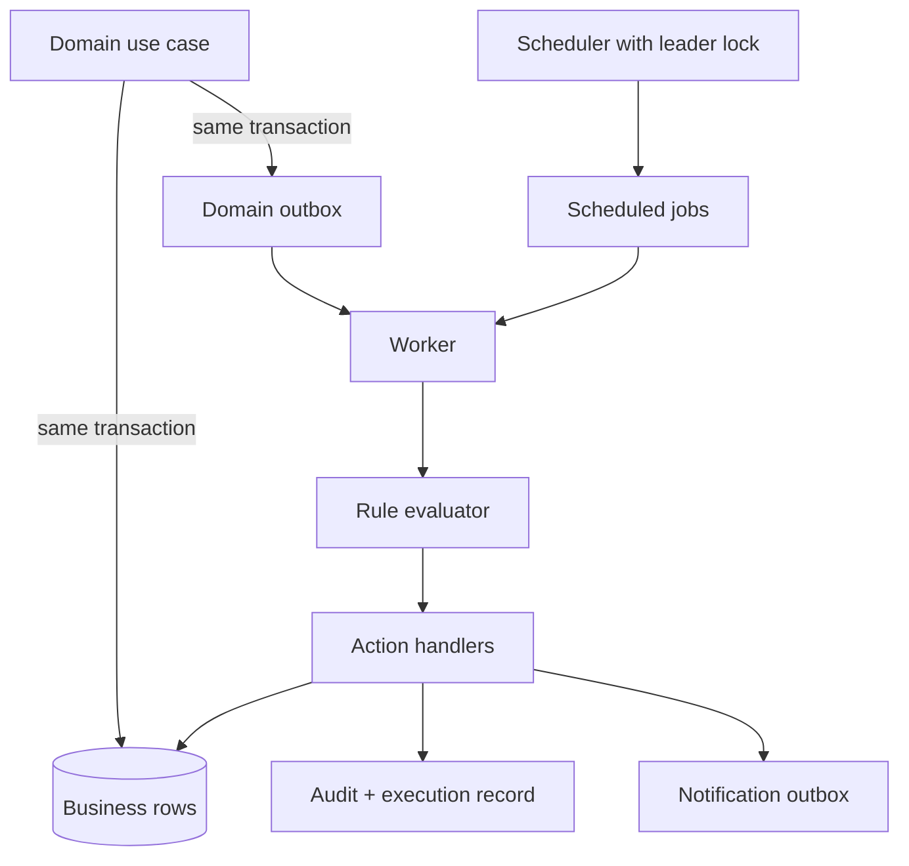

# LAKSHYA V0.1 Automation Architecture

**Status:** Proposed for review

## 1. Scope

V0.1 needs a small deterministic automation engine for reminders, overdue detection, escalation evaluation, notification generation and approved decision-to-commitment conversion. It is not a general workflow platform, AI agent runtime or user-supplied code engine.

The model is:

```text
Trigger -> Conditions -> Actions
```

## 2. Components



- Domain services emit versioned events into `domain_outbox` atomically with changes.
- A scheduler materializes due jobs and runs reconciliation scans. One active scheduler is selected with a PostgreSQL advisory lock.
- Workers claim rows with `FOR UPDATE SKIP LOCKED`, evaluate rules, invoke allow-listed actions and record results.
- Action handlers call the same application use cases as API requests under a system actor with explicit service permissions.

## 3. Event contract

Events contain event ID, schema version, organization, aggregate type/ID/version, event type, occurred time, actor/source, correlation/causation IDs and a minimal payload. Do not copy sensitive entire records into events. Consumers reload authorized current data where necessary and record the fact snapshot used for decisions.

Initial event examples: `task.assigned.v1`, `task.deadline_changed.v1`, `task.completed.v1`, `stuck_item.created.v1`, `dependency.resolved.v1`, `decision.approved.v1`, and `escalation.created.v1`.

## 4. Rule and action model

Rules have a stable identity and immutable versions. A version declares:

- Event and/or scheduled trigger.
- Bounded typed conditions.
- Allow-listed action with validated parameters.
- Scope, effective dates, cooldown/deduplication and author/approver.

V0.1 actions are limited to:

- Create in-app notification/reminder.
- Request escalation-rule evaluation.
- Create an escalation case when a configured escalation rule matches.
- Create one draft or active commitment from an approved decision according to approved policy.
- Enqueue a management-summary refresh/read-model update if later needed.

Rules cannot execute arbitrary code, SQL, HTTP requests or mutate ownership/RACI/priority/deadline. Integrations use separately reviewed adapters.

## 5. Time-based automation

Scheduled logic uses organization timezone/calendar policy but stores instants in UTC. Rather than scheduling one external timer per task, maintain deduplicated scheduled jobs for meaningful deadlines and run a bounded reconciliation query to recover missed jobs.

Examples:

- Deadline change cancels/supersedes old semantic reminder jobs and creates new ones.
- A due job emits `task.deadline_window_reached`; a rule decides whether/whom to remind.
- Periodic reconciliation detects active tasks whose expected jobs are absent.

Reminder windows, working days and quiet hours are configuration and `REQUIRES BUSINESS DECISION`.

## 6. Idempotency and concurrency

At-least-once execution is assumed. Every handler uses a semantic idempotency key such as `(rule_version, trigger_event, target, action)`. A unique database constraint ensures one successful effect. State transitions use optimistic versions or row locks. Stale facts cause reevaluation, not blind action.

Decision-to-commitment conversion has a unique decision/rule source key. Notifications use a deduplication key. Escalations use a partial uniqueness rule for open target/rule cases. An execution may safely be retried after a worker crash.

## 7. Retries and failures

Classify errors:

- Transient: lock timeout, provider timeout, temporary database/network error; retry with exponential backoff and jitter.
- Permanent: invalid rule, unauthorized action, missing required data; stop and require review.
- Conflict/stale: target changed; reload and reevaluate.

Bound retry count and age. Exhausted/permanent executions move to a failed state (dead-letter equivalent) visible to operators, with a redacted error, next action and correlation ID. Manual replay creates a new attempt linked to the original and remains idempotent.

## 8. Auditability and observability

For each evaluation record trigger, rule/version, fact snapshot/hash, condition result, selected action, idempotency key, attempts, actor, timestamps and outcome. Business mutations also create normal audit events. Structured logs and metrics cover queue age, throughput, retries, permanent failures, scheduler lag, notification delivery and duplicate suppression.

Operational logs are not the audit trail. Audit records must remain understandable after logs expire.

## 9. Security

The worker uses a distinct database/runtime identity with only required operations. System actions identify service actor plus originating human/event. Rule editing and activation require separate permissions; higher-impact rule approval separation is recommended. Rule data is validated against a schema and complexity/fan-out limits.

## 10. Evolution

PostgreSQL outbox/jobs are adequate for V0.1. Introduce a broker only when measured throughput, external consumers or availability needs justify it. Stable event/action interfaces allow the transport to change. Future AI may consume events to create recommendations, but cannot register rules or invoke action handlers directly.

## 11. Required business decisions

- Automation rule authors, approvers and emergency-disable authority.
- Reminder windows, working calendar, quiet hours and channel policy.
- Whether approved decisions create draft commitments automatically or require a second confirmation.
- Escalation thresholds and automatic/manual resolution policy.
- Operational ownership and response expectations for failed jobs.
- Data retention for events, executions and notification attempts.

