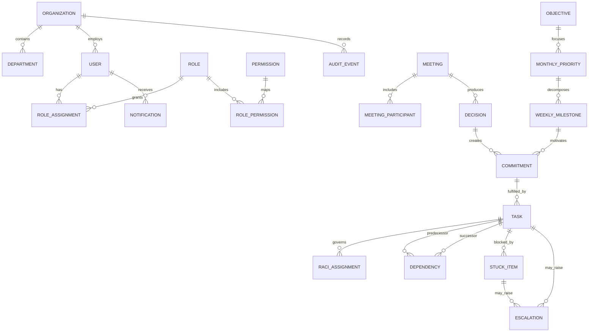

# LAKSHYA V0.1 Domain Model

**Status:** Proposed for review

## 1. Modeling principles

- Preserve distinct business meanings; do not collapse decisions, commitments, tasks, issues, escalations or outcomes into one table.
- Model critical relationships with foreign keys and constraints.
- Separate lifecycle state from derived attention indicators such as "overdue".
- Retain source and provenance so captured information is not re-entered.
- Treat AI output as a recommendation, never as an authoritative domain entity mutation.

## 2. Aggregate overview

This diagram shows primary relationships, not every field or allowed association.

## 3. Identity and organization

### Organization

Top-level security and data boundary. V0.1 has one Stavya organization, but storing the boundary on tenant-owned records prevents cross-organization leakage and future redesign.

### Department

A hierarchical or flat operating unit within an organization. A nullable parent department supports future hierarchy without requiring it in V0.1. Department ownership is not equivalent to visibility; RBAC scope controls visibility.

### User

An authenticated or provisioned person. User identity is organization-wide. Department membership should be modeled separately from the user so transfers and additional memberships retain history. Whether one user may actively belong to multiple departments is `REQUIRES BUSINESS DECISION`.

### Role, Permission and assignments

`Permission` is a stable action identifier. `Role` is an organization-defined bundle. `RoleAssignment` connects a user to a role at organization or department scope with effective dates. `RolePermission` is the many-to-many mapping. Named personas (MD, MD Office, Department Head, Manager, Employee) are seeded role templates, not hard-coded authorization branches.

## 4. Strategy

### Objective

A durable organizational or departmental intended result. It may span months and own multiple monthly priorities. V0.1 needs basic lifecycle and traceability, not a KPI engine.

### Monthly Priority

A time-boxed focus linked to an objective where applicable. Store year/month (or period start/end), owning department, priority/criticality and lifecycle. A priority may be organization-wide or department-owned. The allowed number and ranking method are `REQUIRES BUSINESS DECISION`.

### Weekly Milestone

A measurable result expected within a defined week and linked to one monthly priority. A week is stored as start/end dates using an organization timezone policy. Milestones may create commitments or directly group tasks only if policy permits; the preferred chain is through commitments.

## 5. Meetings and decisions

### Meeting

An official execution source with type (major, cross-functional, one-to-one), scheduling mode (scheduled/non-scheduled), timing, organizer, owning department, agenda and lifecycle. "Type" and "scheduled" are separate attributes, not competing values.

### Meeting Participant

A membership relationship between meeting and user with participant role, attendance and optional response status. It is a table because the relationship has attributes and authorization significance.

### Decision

A durable, searchable management decision, distinct from discussion and task. It records text, context, decision maker, decided date, status, impact and optional meeting/priority/task relationships. A decision's approval is an explicit transition. An approved decision may produce one or more commitments; the conversion is idempotent and traceable.

## 6. Execution

### Commitment

An organizational promise or obligation: what result was committed, by whom/for whom, by when, and from which source. It may originate from an approved decision, milestone, MD instruction, department request or issue. It is not merely a task: a commitment can require multiple executable tasks and has its own accountable result and outcome.

For V0.1, implement explicit foreign keys for approved source types that exist (for example `decision_id`, `milestone_id`) and a controlled source-kind field. Do not use an unconstrained polymorphic ID as the only provenance. MD Instruction is a future source type and should not become a V0.1 module merely to reserve it.

### Task

An executable unit of work. It has an owner (operational assignee), status, deadline, progress, priority/criticality, optional commitment and milestone context, and outcome. "Overdue" is derived from deadline/status, not a mutable status. Parent/child tasks may support decomposition but must not be used to represent dependencies.

### Commitment versus task

One commitment can be fulfilled by zero or more tasks. A draft commitment may exist before task planning. A standalone operational task may exist without a commitment if authorized, but critical or decision-derived work should be promoted into a commitment according to an unresolved policy. Completion of all tasks does not automatically prove the commitment outcome unless a deterministic, approved rule says so.

### RACI Assignment

A first-class relationship between a meaningful work item and a user. In V0.1 apply RACI to commitments and tasks through separate constrained assignments or a shared assignment table with integrity enforcement. RACI is not JSON. Details are in [RACI.md](../business-rules/RACI.md).

### Dependency

A directed relationship where one task depends on another task. It records type, lifecycle, creator and resolution. Self-dependencies, duplicate active edges and cycles are invalid. Cross-department dependencies require visibility rules and may drive notifications or escalation evaluation.

### Outcome

The achieved result and evidence should be retained separately from a status flag. For V0.1, outcome fields can live on commitment/task records if only one final outcome is needed. Create an `outcomes` table later only when verification, multiple measurements, evidence objects or KPI linkage require an independent lifecycle.

`EC` and time-spent semantics are not defined in the product specification: `REQUIRES BUSINESS DECISION`. Do not include them in mandatory V0.1 workflows until defined.

## 7. Attention and escalation

### Stuck Item

A first-class blocker/need attached to a task and optionally a commitment. It captures reason category, narrative need, provider (user/department/external text), required-by date, business impact, status and resolution. A task may have multiple historical stuck items but should not have ambiguous duplicate active blockers for the same need.

### Escalation

A case representing contextual attention raised about a task, commitment, stuck item, dependency, decision need or other approved target. It has rule/manual origin, level, reason, evidence snapshot, assignee/audience, acknowledgment and resolution lifecycle. It references the evaluated rule version so later policy changes do not rewrite history.

Escalation is not synonymous with overdue. It is produced manually or by a satisfied configured rule and remains a durable case after its source condition changes.

## 8. Engagement and evidence

### Notification

A recipient-specific message generated from a domain event, with channel delivery and read state. It is not the source of task/escalation state. Separate notification delivery attempts when multiple attempts/providers must be tracked.

### Audit Event

An immutable record of a security-relevant or business-relevant action. Audit events are not domain events: audit answers "who changed what"; domain events communicate "what happened" to automation. One transaction may produce both.

### Domain Event and Automation records

These technical entities are required even though they are not user-facing: outbox event, automation rule/version, automation execution, scheduled job and delivery attempt. They make automation reproducible and auditable.

## 9. Concepts deliberately not separate V0.1 tables

- Meeting types, lifecycle statuses and reason codes: controlled enums/reference data until user configurability is proven.
- Action: represented as a draft/approved commitment or task linked to a decision; a separate action table would duplicate lifecycle.
- Progress: current percentage/summary plus audit history; a progress-update table is deferred unless threaded reporting is required.
- Issue: future improvement-engine aggregate; V0.1 Stuck/Need covers execution blockers without prematurely building RCA.
- KPI, RCA, AI transcript/recommendation and external integration payload models: future modules behind established boundaries.

## 10. Unresolved model decisions

- `REQUIRES BUSINESS DECISION`: whether users can have multiple active department memberships.
- `REQUIRES BUSINESS DECISION`: which work must have a commitment and which may remain a standalone task.
- `REQUIRES BUSINESS DECISION`: which commitment/task classes require exactly one Accountable assignment.
- `REQUIRES BUSINESS DECISION`: decision approval roles and whether approval is always required.
- `REQUIRES BUSINESS DECISION`: definition and calculation of EC, time spent and progress.
- `REQUIRES BUSINESS DECISION`: outcome verification requirements and evidence retention.
- `REQUIRES BUSINESS DECISION`: organization timezone and week-start convention.

