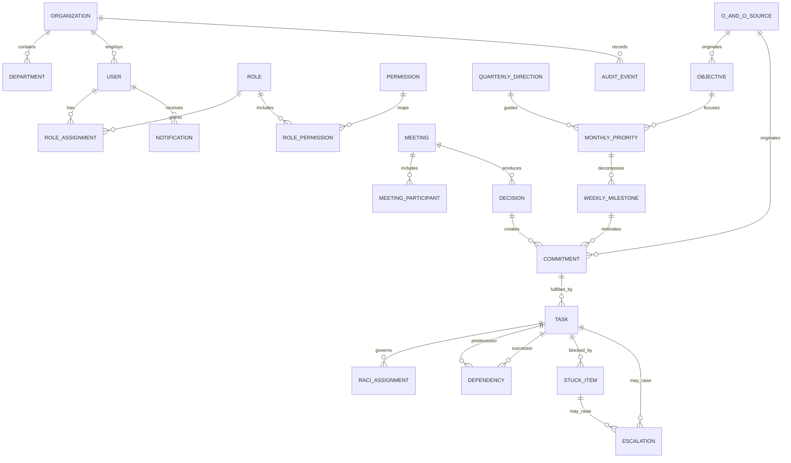

# LAKSHYA V0.1 Domain Model

**Status:** Reconciled with approved Stavya V0.1 business rules

## 1. Modeling principles

- Preserve distinct business meanings; do not collapse decisions, commitments, tasks, issues, escalations or outcomes into one table.
- Model critical relationships with foreign keys and constraints.
- Separate lifecycle state from derived attention indicators such as "overdue".
- Retain source and provenance so captured information is not re-entered.
- Treat AI output as a recommendation, never as an authoritative domain entity mutation.

## 2. Aggregate overview

This diagram shows primary relationships, not every field or allowed association.

## 3. Identity and organization

### Organization

Top-level security and data boundary. V0.1 has one Stavya organization, but storing the boundary on tenant-owned records prevents cross-organization leakage and future redesign.

### Department

A hierarchical or flat operating unit within an organization. A nullable parent department supports future hierarchy without requiring it in V0.1. Department ownership is not equivalent to visibility; RBAC scope controls visibility.

### User

An authenticated or provisioned person. User identity is organization-wide. Department membership should be modeled separately from the user so transfers and additional memberships retain history. Whether one user may actively belong to multiple departments is `REQUIRES BUSINESS DECISION`.

### Role, Permission and assignments

`Permission` is a stable action identifier. `Role` is an organization-defined bundle. `RoleAssignment` connects a user to a role at organization or department scope with effective dates. `RolePermission` is the many-to-many mapping. Named personas (MD, MD Office, Department Head, Manager, Employee) are seeded role templates, not hard-coded authorization branches.

## 4. Strategy

### Quarterly Direction

A planning context for one organizational quarter. It guides one or more Monthly Priorities without creating a V0.1 KPI engine. A Monthly Priority may also relate to an Objective; Quarterly Direction and Objective serve different planning purposes and neither is collapsed into a Task.

### Objective

A durable organizational or departmental intended result. It may span months and own multiple monthly priorities. V0.1 needs basic lifecycle and traceability, not a KPI engine.

### Monthly Priority

A time-boxed focus linked to a Quarterly Direction and optionally an Objective. Store year/month (or period start/end), owning department, priority/criticality and lifecycle. A priority may be organization-wide or department-owned and may change during the month. Each change is a normal authorized mutation with append-only audit before/after evidence; current state does not erase history. The allowed number and ranking method are `REQUIRES BUSINESS DECISION`.

### Weekly Milestone

A measurable result expected within a defined week and linked to one Monthly Priority. A week is stored as start/end dates using an organization timezone policy. Official organizational execution follows `Monthly Priority -> Weekly Milestone -> Commitment -> Task`; standalone self/operational Tasks remain permitted outside a formal Commitment.

## 5. Meetings and decisions

### Meeting

An official execution source with business type (major, cross-functional, one-to-one), scheduling mode (scheduled/non-scheduled), timing, organizer, owning department, agenda and lifecycle. All supported combinations may generate proposed work. "Type" and "scheduled" are separate attributes, not competing values.

### Meeting Participant

A membership relationship between meeting and user with participant role, attendance and optional response status. It is a table because the relationship has attributes and authorization significance.

### Decision

A durable, searchable management decision, distinct from discussion, Commitment and Task. It records text, context, decision maker, decided date, status, impact and optional meeting/priority/task relationships. A decision's approval is an explicit transition. Discussion or extracted action remains proposed work until the required human approval. An approved decision may produce one or more Commitments; conversion is idempotent and traceable.

## 6. Execution

### Commitment

An official organizational result or obligation: what result was committed, by whom/for whom, by when, and from which source. It may originate from an approved decision, milestone, MD instruction, department request, O&O or issue. It is not a Task: a Commitment can require multiple executable Tasks and has its own coordinating owner, Accountable result and outcome. The operational owner does not replace RACI A.

Every official Commitment must have at least one Responsible assignment and exactly one Accountable assignment before activation. C and I are optional. Completion is a separate approval transition performed by the Accountable person or another authorized approver; completing every child Task does not complete the Commitment automatically.

For V0.1, implement explicit foreign keys for approved source types that exist (for example `decision_id`, `milestone_id`) and a controlled source-kind field. Do not use an unconstrained polymorphic ID as the only provenance. MD Instruction is a future source type and should not become a V0.1 module merely to reserve it.

### Task

An executable unit of work. It has an owner (operational assignee), status, deadline, progress, priority/criticality, optional Commitment and milestone context, and outcome. An Employee may create a Task for themself and may complete a normal assigned Task, but may not assign another Employee, change an official organizational deadline, independently change organizational priority, or directly reopen a formally completed Commitment. "Overdue" is derived from deadline/status, not a mutable status. Parent/child Tasks may support decomposition but must not represent dependencies.

### Commitment versus task

One Commitment can be fulfilled by zero or more Tasks. A draft Commitment may exist before task planning. A self-created or authorized standalone operational Task may exist without a Commitment. Formal organizational results use a Commitment. Completion of all Tasks never by itself proves the Commitment outcome; the required Accountable/authorized approval completes it.

### RACI Assignment

A first-class relationship between a meaningful work item and a user. In V0.1 apply RACI to Commitments and Tasks through a shared assignment table with integrity enforcement. Every active official Commitment requires at least one R and exactly one A; C and I are optional. RACI is not JSON. Details are in [RACI.md](../business-rules/RACI.md).

### O&O Source

A lightweight provenance entity representing an O&O reference, not the full future O&O workflow. It records organization, reference/title, source date and origin metadata. Objectives, Monthly Priorities, Weekly Milestones, Commitments, Tasks and future Improvement Actions can reference it. The exact workflow remains unresolved, so V0.1 does not model O&O stages, RCA or autonomous improvement processing.

### Dependency

A directed relationship where one task depends on another task. It records type, lifecycle, creator and resolution. Self-dependencies, duplicate active edges and cycles are invalid. Cross-department dependencies require visibility rules and may drive notifications or escalation evaluation.

### Outcome

The achieved result and evidence should be retained separately from a status flag. For V0.1, outcome fields can live on commitment/task records if only one final outcome is needed. Create an `outcomes` table later only when verification, multiple measurements, evidence objects or KPI linkage require an independent lifecycle.

`EC` and time-spent semantics are not defined in the product specification: `REQUIRES BUSINESS DECISION`. Do not include them in mandatory V0.1 workflows until defined.

## 7. Attention and escalation

### Stuck Item

A first-class blocker/need attached to a task and optionally a commitment. It captures reason category, narrative need, provider (user/department/external text), required-by date, business impact, status and resolution. A task may have multiple historical stuck items but should not have ambiguous duplicate active blockers for the same need.

### Escalation

A case representing contextual attention raised about a task, commitment, stuck item, dependency, decision need or other approved target. It has rule/manual origin, level, reason, evidence snapshot, assignee/audience, acknowledgment and resolution lifecycle. It references the evaluated rule version so later policy changes do not rewrite history.

Escalation is not synonymous with overdue. It is produced manually or by a satisfied configured rule and remains a durable case after its source condition changes.

## 8. Engagement and evidence

### Notification

A recipient-specific message generated from a domain event, with channel delivery and read state. It is not the source of task/escalation state. Separate notification delivery attempts when multiple attempts/providers must be tracked.

### Audit Event

An immutable record of a security-relevant or business-relevant action. Audit events are not domain events: audit answers "who changed what"; domain events communicate "what happened" to automation. One transaction may produce both.

### Domain Event and Automation records

These technical entities are required even though they are not user-facing: outbox event, automation rule/version, automation execution, scheduled job and delivery attempt. They make automation reproducible and auditable.

## 9. Concepts deliberately not separate V0.1 tables

- Meeting types, lifecycle statuses and reason codes: controlled enums/reference data until user configurability is proven.
- Action: represented as a draft/approved commitment or task linked to a decision; a separate action table would duplicate lifecycle.
- Progress: current percentage/summary plus audit history; a progress-update table is deferred unless threaded reporting is required.
- Issue and Improvement Action: future improvement-engine aggregates. A lightweight O&O source preserves provenance in V0.1 without prematurely building the workflow.
- KPI, RCA, AI transcript/recommendation and external integration payload models: future modules behind established boundaries.

## 10. Unresolved model decisions

- `REQUIRES BUSINESS DECISION`: whether users can have multiple active department memberships.
- `REQUIRES BUSINESS DECISION`: decision approval roles and whether approval is always required.
- `REQUIRES BUSINESS DECISION`: alternate Commitment completion and reopening authority.
- `REQUIRES BUSINESS DECISION`: Manager team and Department Head hierarchy data source.
- `REQUIRES BUSINESS DECISION`: same-person R+A and multiple-Responsible rules.
- `REQUIRES BUSINESS DECISION`: exact O&O workflow and Improvement Action lifecycle.
- `REQUIRES BUSINESS DECISION`: definition and calculation of EC, time spent and progress.
- `REQUIRES BUSINESS DECISION`: outcome verification requirements and evidence retention.
- `REQUIRES BUSINESS DECISION`: organization timezone and week-start convention.
