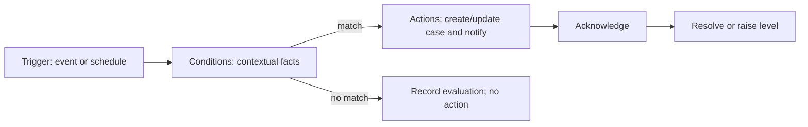

# LAKSHYA V0.1 Escalation Architecture

**Status:** Reconciled configurable design; thresholds remain unresolved

## 1. Principle

Escalation is a contextual, durable management-attention case. `overdue != automatically escalated`. Rules may consider priority, criticality, business impact, deadline/delay, progress, blocker, dependency, decision need and risk. No threshold in this document is a business rule.

`Stuck / Need -> Escalation -> Resolution` is the approved attention chain, but an open Stuck/Need does not automatically create an Escalation. A configured deterministic rule or authorized manual action must create the case.

Provisional labels from the product specification are L0 Normal, L1 Attention, L2 Escalated and L3 Management/MD Attention. Their names, audiences and authorities are `REQUIRES BUSINESS DECISION`.

## 2. Rule model

An escalation rule has stable identity, scope, enabled state and immutable versions. A version contains:

- Trigger: event types and/or scheduled evaluation cadence.
- Eligibility: target type, department, priority/criticality class and lifecycle.
- Conditions: typed field/operator/value expressions combined with bounded AND/OR groups.
- Action: level, audience resolver, acknowledgment expectation, notification template and repeat/cooldown policy.
- Governance: author, approver, effective period, version notes and test examples.

V0.1 uses a limited validated condition DSL represented as versioned JSON, not executable Python/SQL supplied by users. Unknown fields/operators fail closed. Rule activation validates schema and records approval.

## 3. Context facts

The evaluator builds a time-stamped fact snapshot from authoritative data:

- Priority and criticality.
- Deadline, organization-local current time and calculated delay duration.
- Task/commitment lifecycle and progress.
- Open Stuck/Need reason, required-by and business impact.
- Unresolved dependencies and whether the predecessor is late/blocked.
- Required decision and designated provider/decision maker where modeled.
- Existing open escalation, level, acknowledgment and cooldown.

Derived facts are versioned calculations. The evidence snapshot and calculation version are stored with the execution/case for reproducibility.

## 4. Evaluation and case lifecycle

1. Domain events request immediate evaluation for relevant changes; a scheduler catches time-based conditions and missed events.
2. Claim target/rule/version with an idempotency key.
3. Load a consistent fact snapshot and evaluate active rule version.
4. If matched, create or update the permitted escalation case; never create duplicate open cases accidentally.
5. Commit case/event, audit evidence and notification outbox atomically.
6. Delivery occurs asynchronously and cannot undo case creation.

Case states are `open -> acknowledged -> resolved`, with `cancelled` for invalid/withdrawn cases. Level changes append events. Resolution records actor, time, resolution reason, notes and relevant outcome; source data is not rewritten. If the condition recurs after resolution, cooldown/reopen policy determines whether a new case is created.

## 5. Manual escalation

Authorized users may raise a manual case with target, requested level, reason, impact and evidence. Manual escalation bypasses threshold matching but not authorization, scope, duplication control or audit. It must be distinguishable from rule-generated cases. Whether stavyans can escalate, and to what audience, is `REQUIRES BUSINESS DECISION`.

## 6. Acknowledgment and resolution

Acknowledge means an authorized recipient has accepted awareness/ownership of attention; it does not mean the problem is resolved. Acknowledgment deadlines and non-acknowledgment actions must be configured, not embedded in code.

Resolution requires a structured reason and optional evidence. The resolver must have explicit authority for the level/scope. Automatic resolution is disabled by default; a deterministic approved rule may propose or perform it only if policy explicitly allows and the event is audited.

## 7. Notification behavior

Audience resolvers may select task R/A, manager, department head, MD Office or MD, subject to approved organization mapping. Use deduplication, cooldown, digesting and severity-aware channels to prevent fatigue. Mandatory escalation notices cannot be disabled through ordinary preferences. Provider failure creates delivery retries/operational alerts, not another organizational escalation unless separately configured.

## 8. Safety and governance

- Draft, test and approve rule versions before activation.
- Provide dry-run evaluation against representative sanitized cases and show expected matches/non-matches.
- Activation is prospective; old cases retain old version evidence.
- Rule author/approver separation is recommended for L2/L3 rules: `REQUIRES BUSINESS DECISION`.
- Bound evaluation complexity, rule count, repeat frequency and recipient fan-out.
- Record false-positive/false-negative review feedback without allowing AI to self-modify rules.
- Use a kill switch per rule and globally; disabling stops new evaluations but preserves history.

Future Execution Intelligence may recommend risk classifications, next actions or a smart escalation. It remains advisory for escalation and cannot create/change/resolve a high-impact case without the applicable human approval. Deterministic approved rules remain the V0.1 execution mechanism.

## 9. Assumptions

- Organization timezone and business calendar will be configured before time rules go live.
- Initial escalation is internal/in-app unless an external channel is approved.
- V0.1 rule facts come only from LAKSHYA authoritative records; external risk signals are future integrations.

## 10. Required business decisions

1. Validate levels, meanings, target audiences and resolution authorities.
2. Define priority, criticality and business-impact scales.
3. Define delay/required-by calculations, working hours, holidays and grace periods.
4. Define which statuses pause or suppress evaluation.
5. Define blocker/dependency/decision thresholds and cross-department routing.
6. Define acknowledgment expectations, level progression, cooldown and recurrence.
7. Decide manual escalation rights and protection against retaliatory visibility.
8. Decide mandatory channels, digest policy and after-hours behavior.
9. Decide rule approval/maker-checker policy and emergency disable authority.
10. Define resolution evidence and whether any case may auto-resolve.
