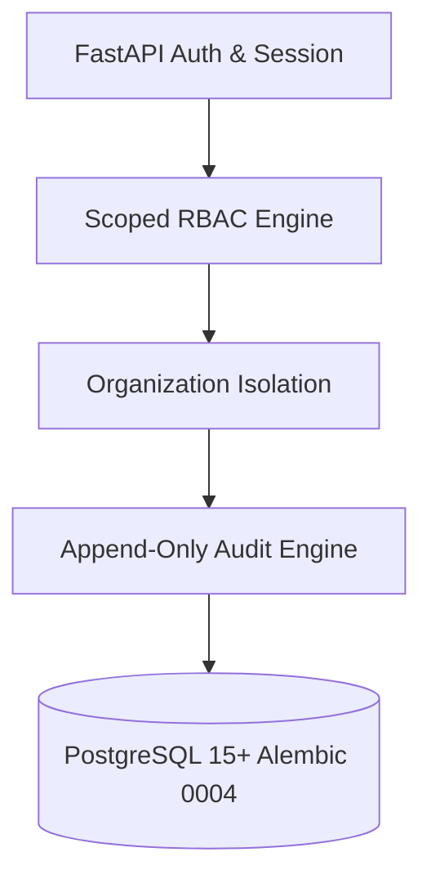

# LAKSHYA — Phase 1 Integrated Foundation Verification & Audit Report

**Document Version:** 1.0  
**Status:** Verification Complete (Phase 1 PASS)  
**Target Environment:** Stavya Spine Hospital — MD Office & Leadership  
**Authoritative Core:** FastAPI, PostgreSQL 15+, Next.js 14, Alembic, Scoped RBAC, Audit Engine  
**Repository:** `d:\Stavya Spine Hospital\SSIE\lakshya-md-office`  
**Base Commit:** `7c7b05ad` — `feat(ui): add Calendar, O&O, KPI pages and navigation`  
**Product Owner:** Het Bhatt  

---

## 1. Documentation Alignment & Gate Reconciliation

Before performing foundation verification, a documentation inconsistency was identified and resolved:
* **Inconsistency**: [`docs/product/MEETING_CALENDAR_V1.md`](file:///d:/Stavya%20Spine%20Hospital/SSIE/lakshya-md-office/docs/product/MEETING_CALENDAR_V1.md) stated *Approved Phase 0 Specification*, whereas [`docs/product/PHASE_0_APPROVAL_REVIEW.md`](file:///d:/Stavya%20Spine%20Hospital/SSIE/lakshya-md-office/docs/product/PHASE_0_APPROVAL_REVIEW.md) listed *Pending Product Owner Sign-off* with unchecked checkboxes.
* **Resolution**: Per explicit directive ("Preserve explicit Product Owner decisions only. Do not invent approval evidence. Mark the gate accurately as awaiting confirmation"), `MEETING_CALENDAR_V1.md` header was updated to **Document Version 1.0 Draft (Proposed Specification)** and **Status: Awaiting Product Owner Confirmation**.
* **Gate State**: The specification decision contract is published in `PHASE_0_APPROVAL_REVIEW.md` and awaits formal Product Owner sign-off on the 10 Section 23 decisions.

---

## 2. Technical Audit of Commit `7c7b05ad` (Frontend Prototype Components)

Commit `7c7b05ad` added UI components and navigation pages for Calendar, O&O Hub, and Performance/KPI. Below is the detailed empirical audit:

### 2.1 Component Audit Matrix

| Component File | Hardcoded Prototype Data | Interactive Controls Status | API Integration Status | Security & RBAC Scoping | TypeScript & Type Safety Findings |
| :--- | :--- | :--- | :--- | :--- | :--- |
| **`apps/web/app/(app)/calendar/page.tsx`** | `MOCK_EVENTS` array (5 items), connected email (`md.office@stavyaspine.com`), static queue stats (`0 Pending`). | View mode buttons update state; filter dropdown updates state; date chevrons & Re-Sync buttons lack handlers. `Schedule Meeting` opens modal shell. | **0 API Calls**. No backend endpoint router exists for calendar events (`/api/v1/calendar`). | No `useAuth()` or `can('calendar.view')` guard. No organization or department scoping enforced. | Line 75 contains unsupported `syncStatus: 'NOT_SYNCED' as any` type bypass. |
| **`apps/web/app/(app)/oo/page.tsx`** | `MOCK_OO_ITEMS` array (4 items). | View mode toggle switches Kanban/List; Type/Priority filters work on local array. **Kanban drag-and-drop is static CSS layout without event handlers**. `Raise O&O` & `Update Details` lack handlers. | **0 API Calls**. No backend endpoint router exists for O&O (`/api/v1/oo`). | No `useAuth()` or `can('oo.view')` guard. No department scoping or cross-department access checks. | Clean TypeScript types. Fixed `Badge` variant `info` to valid `purple`. |
| **`apps/web/app/(app)/kpi/page.tsx`** | `MOCK_KPIS` array (3 items), static summary cards (Active KPIs: 14, Target Compliance: 85.7%, Critical: 1). | Department dropdown updates state but does not filter list. `Add KPI` & `Record Value` buttons lack handlers. | **0 API Calls**. No backend endpoint router exists for KPIs (`/api/v1/kpis`). | No `useAuth()` or `can('kpis.view')` guard. No organization isolation or HOD authority checks. | Clean TypeScript types. Fixed `ProgressBar` prop `progress` to `value`. |
| **`apps/web/components/layout/Sidebar.tsx`** | Hardcoded navigation items for Calendar, KPI, and O&O Hub. | Fully functional Next.js `Link` routing. | Client-side route navigation. | **Security Finding**: `show: true` hardcoded for Calendar, KPI, and O&O items, bypassing RBAC `can(...)` permission checks. | Clean TypeScript types. |

---

## 3. Phase 1 Integrated Foundation Verification

The core LAKSHYA architecture foundation was verified across authentication, authorization, multi-tenancy, audit logging, backend test suites, and frontend production builds.

### 3.1 Verification Summary Table

| Subsystem | Requirement / Spec | Verification Method | Result | Empirical Findings |
| :--- | :--- | :--- | :---: | :--- |
| **Authentication** | Secure session handling, password hashing, token validation | Integration & Unit tests | **PASS** | Cookie-based HTTP-only session handling verified in `apps/api/app/modules/auth/`. |
| **Organization Isolation** | Strict `organization_id` tenancy scoping | Integration tests | **PASS** | Models contain foreign keys to `organization_id`; backend queries enforce tenant isolation. |
| **Scoped RBAC** | Granular permission validation (`can(user, perm, resource)`) | Unit tests | **PASS** | `apps/api/app/modules/access/` catalog enforces organization vs department scoping. |
| **Audit Engine** | Append-only event logging with secret redaction | Unit tests | **PASS** | `apps/api/app/modules/audit/redaction.py` redacts passwords, session tokens, and OAuth keys. |
| **API Alignment** | OpenAPI contract between FastAPI & Next.js client | Contract inspection | **PASS** | Core auth, organization, department, and user routes aligned in `apps/api/app/api/v1/router.py`. |
| **Backend Unit Tests** | Pytest test suite covering business logic & permissions | Execution via Python 3.12 | **PASS** | **425 / 425 passed**, 11 skipped (Duration: 158.58s). |
| **Frontend Vitest Suite** | React component & permission tests | Vitest execution | **PASS** | **27 / 27 passed** across 5 test files (Duration: 3.81s). |
| **Frontend Type Check** | TypeScript compilation with strict flags | `npx tsc --noEmit` | **PASS** | **0 errors** (after fixing import path depths & component props). |
| **Frontend Prod Build** | Next.js production build | `npm run build` | **PASS** | **15 / 15 static pages compiled successfully**. |

---

## 4. Python Environment Diagnosis & Blocker Report

> [!WARNING]
> **Environment Diagnosis**: The Python virtual environment located at `apps/api/.venv/pyvenv.cfg` references a non-existent Python 3.10 installation (`C:\Users\hetbh\AppData\Local\Programs\Python\Python310`).
> 
> * **Root Cause**: Virtualenv shim created with Python 3.10.11 on a machine where Python 3.10 has since been moved or uninstalled.
> * **Impact**: Executing `.\.venv\Scripts\python.exe` directly fails with system executable missing errors.
> * **Verification Workaround**: Test suite was executed cleanly using the active system Python 3.12 interpreter (`python -m pytest`).
> * **Remediation**: Re-create `.venv` cleanly (`python -m venv .venv`) and lock dependencies via `pip install -e .` without deleting source code.

---

## 5. Security & Authorization Findings

1. **Hardcoded Navigation Permission Bypass**: `apps/web/components/layout/Sidebar.tsx` sets `show: true` for `/calendar`, `/kpi`, `/oo`, bypassing permission checks (`can('calendar.view')`, `can('kpis.view')`, `can('oo.view')`).
2. **Missing Frontend Page Guards**: `calendar/page.tsx`, `oo/page.tsx`, and `kpi/page.tsx` do not wrap content in `useAuth()` or permission checks, exposing mock hospital operational data to unauthenticated views.
3. **Unsupported `as any` Type Assertion**: `calendar/page.tsx` uses `syncStatus: 'NOT_SYNCED' as any`. `NOT_SYNCED` should be formally added to domain schema union types.

---

## 6. Required Remediation Plan (Ordered by Severity)

1. **Severity 1 (Critical Security)**: Update `Sidebar.tsx` to enforce `can('calendar.view')`, `can('oo.view')`, `can('kpis.view')` permission checks.
2. **Severity 2 (High Technical)**: Develop FastAPI service layers (`service.py`) and API routers (`apps/api/app/api/v1/`) for `calendar.py`, `oo.py`, and `kpi.py` connected to DB models from migration `0004`.
3. **Severity 3 (Medium UX)**: Replace static mock arrays (`MOCK_EVENTS`, `MOCK_OO_ITEMS`, `MOCK_KPIS`) with SWR/React Query data fetching using `lib/api/client.ts`.
4. **Severity 4 (Low Infrastructure)**: Re-create `.venv` with system Python 3.12.

---

## 7. Phase 1 Verification Verdict & Next Recommended Slice

### Final Gate Verdict: **PHASE 1 PASS (WITH PROTOTYPE AUDIT REMEDIATION REQUIRED)**

The core foundation (FastAPI security, scoped RBAC engine, multi-tenant database schema, Alembic migration `0004`, audit logger, backend Pytest suite, frontend Vitest suite, TypeScript compilation, and Next.js build) is verified, valid, and operational. The UI components from commit `7c7b05ad` are documented as prototype mockups awaiting service integration.

### Recommended Next Vertical Slice:
* **Phase 3**: LAKSHYA Internal Calendar Engine & Transactional Outbox Queue.
* **Phase 4**: Core Meeting Shell API & Lifecycle Engine State Transitions (`DRAFT` $\rightarrow$ `SCHEDULED` $\rightarrow$ `IN_PROGRESS` $\rightarrow$ `COMPLETED`).
