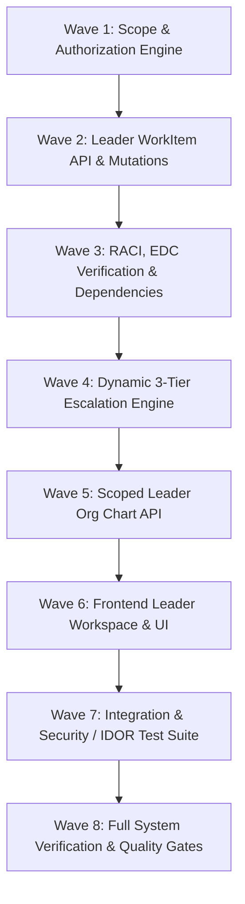

# LAKSHYA V1 — Phase 2 Implementation Plan (PLAN.md)
## Leader Experience & Department Execution

**Phase:** Phase 2  
**Specification:** `docs/product/SPEC.md`  
**Decisions Contract:** `docs/decisions/DECISIONS.md`  
**Status:** READY FOR EXECUTION  

---

## 1. Executive Summary & Architectural Scope

Phase 2 builds the complete, server-authoritative **Leader Vertical Slice** for LAKSHYA:
`Login → Leader Workspace → Organization-Derived Scope (Model D) → Team Work → Task Management → RACI → EDC Verification → Dependencies → 3-Tier Escalation → Interactive Scope Org Chart → Append-Only Audit`.

### Core Technical Invariants:
1. **Model D Scope Resolution:** A Leader's operational scope is dynamically resolved by the backend from:
   - Direct and indirect reporting subordinates (`Position` tree traversal).
   - Assigned primary department membership (`DepartmentMembership`).
   - Tasks where the Leader is explicitly named in the RACI matrix (`R`, `A`, `C`, `I`).
2. **Zero Parallel Organization Tables:** No `team_members` or parallel leader-mapping tables are introduced; the database position graph is authoritative.
3. **Strict IDOR & Server-Side Security:** Any attempt to read or mutate work items outside the Leader's computed scope returns `404 Not Found` or `403 Permission Denied`.
4. **Action-First Information Hierarchy:**
   `1. Attention Required (Blocked / Escalated / Overdue)` $\rightarrow$ `2. Today & Upcoming` $\rightarrow$ `3. Team Workload & Members` $\rightarrow$ `4. Organization Scope Tree`.

---

## 2. GSD Task Execution Waves

---

## 3. Wave Breakdown & Atomic Tasks

<task id="task-2.1.1">
<title>Wave 1: Leader Scope & Subtree Computation Service</title>
<description>
Enhance `PositionService` and `AuthorizationService` to ensure `AuthorizationContext` dynamically loads:
1. `subordinate_user_ids`: Recursive traversal of child positions from the Leader's active position.
2. `leader_department_ids`: Primary department assigned to the leader.
3. `delegated_scope_ids`: Explicit delegations (if any).
Ensure queries execute cleanly without N+1 overhead.
</description>
<affected_files>
- `apps/api/app/modules/organization/service.py`
- `apps/api/app/modules/access/authorization.py`
- `apps/api/app/api/deps.py`
</affected_files>
<verification>
Unit test verifying recursive subtree resolution for single, multi-level, and vacant positions.
</verification>
</task>

<task id="task-2.2.1">
<title>Wave 2: Server-Side WorkItem Visibility & Leader Mutations</title>
<description>
Update `WorkItemService` and `/api/v1/work_items` endpoints to enforce:
- **Visibility Filtering:** Leader sees own tasks + subordinate tasks + department tasks + RACI tasks.
- **Assignment Mutation:** Leader can assign/reassign within their subordinate and department scope.
- **Priority & Deadline Mutation:** Leader can modify priorities (`low`, `medium`, `high`, `urgent`) and deadlines for subordinate tasks.
- **IDOR Protection:** Accessing an out-of-scope task returns `404 Not Found` or `403 Forbidden`.
- **Auditing:** State/priority/deadline changes record append-only audit events (`work_item.updated`, `work_item.assigned`).
</description>
<affected_files>
- `apps/api/app/modules/work_item/service.py`
- `apps/api/app/modules/work_item/schemas.py`
- `apps/api/app/api/v1/work_items.py`
- `apps/api/app/modules/audit/redaction.py`
</affected_files>
<verification>
Integration tests verifying that Leader A can mutate subordinate tasks but is denied when mutating Leader B's subordinate tasks.
</verification>
</task>

<task id="task-2.3.1">
<title>Wave 3: RACI Management, EDC Verification & Intra/Cross-Team Dependencies</title>
<description>
Implement:
1. **RACI Mutation:** Leader can configure `R` (Responsible), `A` (Accountable), `C` (Consulted), `I` (Informed). Validates exactly one `A`.
2. **EDC (Evidence & Completion Verification):** Routine tasks can be marked `completed` directly. Formal Commitments enter `ready_for_review` and require `A` or Leader verification to transition to `verified_completed`.
3. **Dependency Engine:** Declare blocking dependency on intra-team or cross-team tasks. Cross-team dependency generates notification and exposes read-only minimal status without permitting mutation.
</description>
<affected_files>
- `apps/api/app/modules/work_item/models.py`
- `apps/api/app/modules/work_item/service.py`
- `apps/api/app/modules/work_item/schemas.py`
- `apps/api/app/api/v1/work_items.py`
</affected_files>
<verification>
Pytest cases testing RACI single-A constraint, completion verification gate, and cross-team dependency declaration.
</verification>
</task>

<task id="task-2.4.1">
<title>Wave 4: Dynamic 3-Tier Escalation Engine & Inbound Triage</title>
<description>
Implement dynamic reporting hierarchy escalation resolution in `WorkItemService.escalate_work_item`:
- **Tier 1 (Direct Leader):** Parent position occupant (`reports_to_position_id`).
- **Tier 2 (Department Head):** Department leadership occupant.
- **Tier 3 (MD / MD Office):** Hospital executive leadership.
- **Inbound Leader Inbox:** Endpoint `/api/v1/work_items/escalations/inbox` listing pending escalations assigned to the caller, supporting resolution (`resolve_escalation`) or escalation up to the next tier (`re_escalate`).
</description>
<affected_files>
- `apps/api/app/modules/work_item/service.py`
- `apps/api/app/modules/work_item/schemas.py`
- `apps/api/app/api/v1/work_items.py`
</affected_files>
<verification>
Test verifying dynamic resolution across 3 tiers, transfer invariance, and escalation resolution mutation.
</verification>
</task>

<task id="task-2.5.1">
<title>Wave 5: Scoped Leader Org Chart API</title>
<description>
Implement `/api/v1/organizations/tree/scoped`:
- For Leader, returns the subtree rooted at their position, showing reportees, positions, vacancies, and aggregate active task counts per node.
- Explains scope relationship (`why is this user in my scope`).
- Strict isolation: Does not leak peer departments or hospital-wide unpermitted branches.
</description>
<affected_files>
- `apps/api/app/modules/organization/service.py`
- `apps/api/app/modules/organization/schemas.py`
- `apps/api/app/api/v1/organizations.py`
</affected_files>
<verification>
Test verifying scoped tree returns strictly leader's subtree with accurate task counts and vacancy indicators.
</verification>
</task>

<task id="task-2.6.1">
<title>Wave 6: Frontend Leader Workspace & Operational UI</title>
<description>
Build the dedicated Next.js Leader Workspace in `apps/web`:
1. **Attention Required Component:** Inbound escalations triage, blocked tasks, and overdue items.
2. **Execution Pipeline (Today & Upcoming):** Subordinate task board with quick filters (by reportee, priority, status).
3. **Team Workload & Members Panel:** Capacity indicators and task counts per team member.
4. **Task Detail Modal / Drawer:** RACI matrix editor, EDC evidence verification controls, dependency links, and escalation trigger.
5. **Interactive Scoped Org Chart Component:** Visualizing the leader's reporting tree and vacant posts.
6. **Unified Client API:** Integrate with live FastAPI `/api/v1` endpoints with CSRF injection.
</description>
<affected_files>
- `apps/web/app/(app)/overview/page.tsx`
- `apps/web/components/leader/AttentionRequiredCard.tsx`
- `apps/web/components/leader/TeamWorkloadGrid.tsx`
- `apps/web/components/leader/ScopedOrgTree.tsx`
- `apps/web/components/work/TaskDetailDrawer.tsx`
- `apps/web/lib/api/client.ts`
- `apps/web/types/workItem.ts`
</affected_files>
<verification>
Vitest frontend test suite verifying component rendering, escalation resolution interaction, and scope-based task display.
</verification>
</task>

<task id="task-2.7.1">
<title>Wave 7: Integration & Security / IDOR Test Suite</title>
<description>
Implement comprehensive end-to-end security and authorization tests in `tests/integration/test_leader_security.py`:
1. Leader A accessing Leader B's task (Expect 404/403).
2. Leader modifying tasks in another department (Expect 403).
3. Leader assigning task to an employee outside authorized subtree/department (Expect 403/422).
4. Employee attempting Leader actions (Expect 403).
5. Employee transfer from Leader A to Leader B: Leader B immediately gains visibility; Leader A loses visibility.
6. Multi-tier dynamic escalation resolution with vacant intermediate position handling.
</description>
<affected_files>
- `apps/api/tests/integration/test_leader_security.py`
- `apps/api/tests/integration/test_work_items.py`
</affected_files>
<verification>
Run `pytest tests/integration/test_leader_security.py` confirming 100% green passing tests.
</verification>
</task>

<task id="task-2.8.1">
<title>Wave 8: Full System Verification & Quality Gates</title>
<description>
Execute all backend and frontend quality checks:
- Backend: `pytest`, `ruff check`, `ruff format --check`, `mypy`.
- Frontend: `npm run test`, `npm run typecheck`, `npm run lint`, `npm run build`.
</description>
<affected_files>
- Codebase-wide validation.
</affected_files>
<verification>
All automated linters, typecheckers, test suites, and build scripts pass without warnings or errors.
</verification>
</task>

---

## 4. API Endpoints Specification Summary

| Method | Path | Auth | Authorization | Description |
| :--- | :--- | :--- | :--- | :--- |
| `GET` | `/api/v1/work_items` | Session Cookie | `WORK_ITEM_READ` | Scoped task list (filtered by Model D) |
| `POST` | `/api/v1/work_items` | Session Cookie + CSRF | `WORK_ITEM_CREATE` | Create task (self or scoped reportee) |
| `PATCH` | `/api/v1/work_items/{id}` | Session Cookie + CSRF | `WORK_ITEM_UPDATE` | Update priority, deadline, status, owner |
| `POST` | `/api/v1/work_items/{id}/verify` | Session Cookie + CSRF | `WORK_ITEM_VERIFY` | Leader/Accountable sign-off on EDC |
| `POST` | `/api/v1/work_items/{id}/escalate` | Session Cookie + CSRF | `WORK_ITEM_ESCALATE` | Dynamic 3-Tier escalation |
| `GET` | `/api/v1/work_items/escalations/inbox` | Session Cookie | `LEADER` role | Inbound escalations awaiting triage |
| `POST` | `/api/v1/work_items/escalations/{id}/resolve` | Session Cookie + CSRF | `LEADER` role | Resolve blocker and unfreeze task |
| `GET` | `/api/v1/organizations/tree/scoped` | Session Cookie | `ORGANIZATION_READ` | Scoped reporting tree for leader |

---

## 5. Definition of Done for Phase 2

- [x] SPEC.md and DECISIONS.md locked and referenced.
- [ ] Backend Model D scope and 3-Tier escalation fully implemented and tested.
- [ ] Zero IDOR vulnerabilities across all work item and escalation endpoints.
- [ ] Dedicated Leader Workspace UI rendered with Action-First hierarchy.
- [ ] Transfer invariant verified: Employee transfer dynamically updates Leader visibility without task re-writing.
- [ ] All automated quality gates (`pytest`, `mypy`, `ruff`, `npm test`, `npm run build`) passing 100%.
