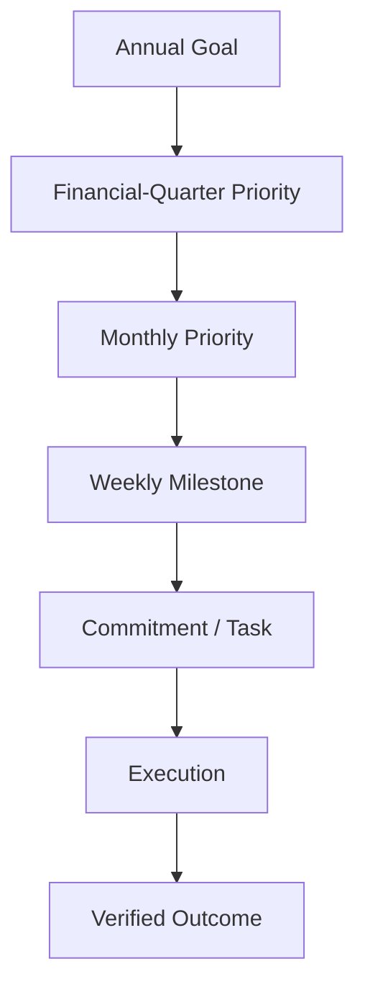
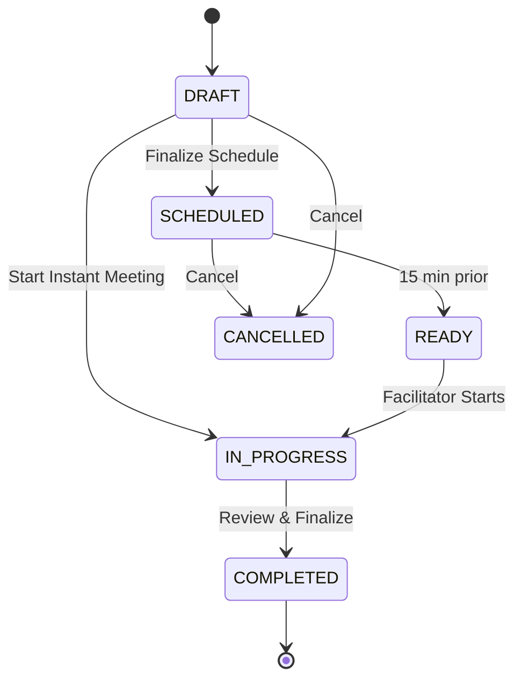
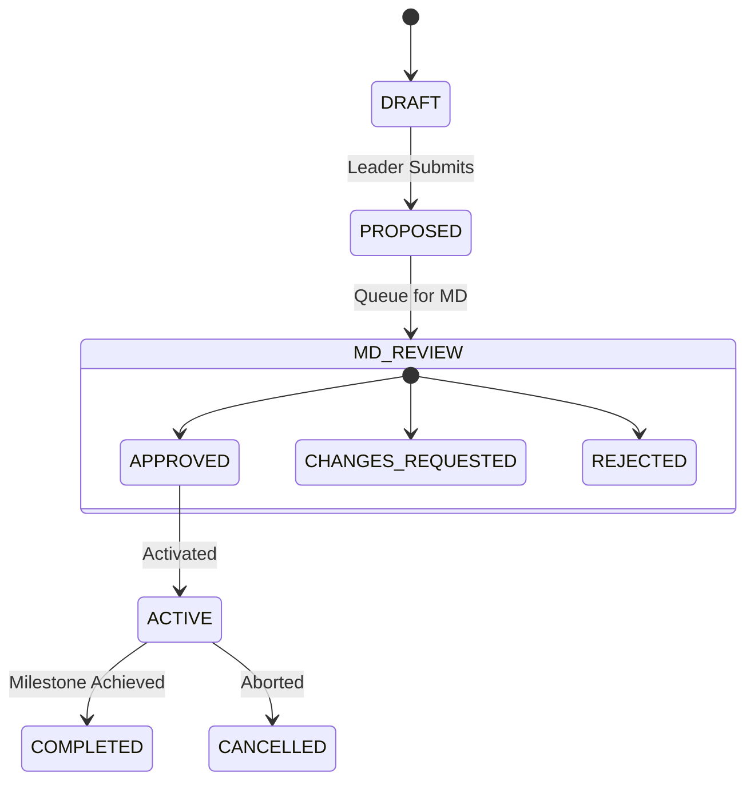
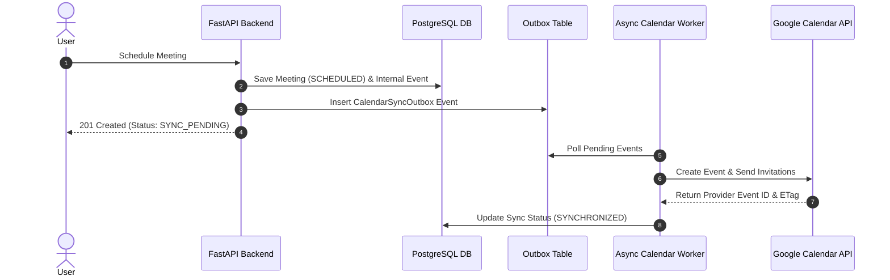

# LAKSHYA — Meeting, Strategy, KPI, O&O and Calendar Redevelopment (V1 Specification)

**Document Version:** 1.0  
**Status:** Phase 0 Specification (Pending Review & Approval)  
**Target Environment:** Stavya Spine Hospital — MD Office & Leadership  
**Authoritative Backend:** FastAPI, PostgreSQL, Alembic, Scoped RBAC, Audit Engine  
**Product Owner:** Het Bhatt  

---

## 1. Executive Vision & Core Philosophy

LAKSHYA is an automation-first **Management Operating System** designed for Stavya Spine Hospital. It converts strategic organizational goals, meeting decisions, KPIs, leadership instructions, and operational obstacles into structured execution, accountability, and measurable outcomes.



### Supporting Pipelines
* **Meeting Pipeline:** $\text{Meeting} \rightarrow \text{Decision} \rightarrow \text{Action} \rightarrow \text{Task}$
* **Escalation Pipeline:** $\text{Issue} \rightarrow \text{Stuck/Need} \rightarrow \text{Escalation} \rightarrow \text{Resolution}$
* **O&O Pipeline:** $\text{Obstacle / Opportunity} \rightarrow \text{Review} \rightarrow \text{Action} \rightarrow \text{Resolution / Implementation}$

---

## 2. Approved Product Definitions

### 2.1 O&O (Obstacle and Opportunity)
A first-class organizational object capturing operational bottlenecks (Obstacles) or strategic improvements (Opportunities) raised during meetings or daily work.

### 2.2 Financial Quarter Priorities & MD Approval Rules
* Follows the **Indian Financial Year** (1 April to 31 March).
* Leaders may propose Quarterly Priorities.
* **Only the MD may approve** Quarterly Priorities.
* Approved Quarterly Priorities link downstream to Monthly Priorities and Weekly Milestones.

### 2.3 Participant & Organizer Editing Boundaries
* **Participants** may edit ONLY information assigned to them (agenda items, check-ins, assigned milestone updates, assigned KPI values).
* **Organizers** control meeting structure, timing, agenda sequence, and section progression.
* Organizers do NOT automatically gain authority to overwrite another owner's organizational updates.
* **MD approval actions** are strictly restricted to the MD role/permission (`goals.approve`, `priorities.approve`).

### 2.4 Calendar & Synchronization Rules
* **Internal Unified Calendar**: LAKSHYA has its own native calendar rendering scheduled meetings, strategic review dates, milestone reviews, and connected external events.
* **Scheduled Meetings**: Added to the LAKSHYA Calendar and synchronized to external calendars (Google Calendar initial integration). Calendar provider invitations are sent immediately upon successful scheduled meeting creation via a background outbox worker.
* **Instant / Non-Scheduled Meetings**: Start immediately (`IN_PROGRESS`). They **do not** create external calendar events and **do not** send calendar invitations or scheduled reminders.

---

## 3. Financial Year & FinancialPeriod Engine

Quarterly Priorities must adhere strictly to the Indian Financial Year:
* **Financial Year**: 1 April through 31 March (e.g., `FY 2026–27`).
* **Q1**: 1 April – 30 June
* **Q2**: 1 July – 30 September
* **Q3**: 1 October – 31 December
* **Q4**: 1 January – 31 March

### Backend `FinancialPeriod` Domain Policy
* Deterministically computes the financial year and quarter for any given date.
* Returns exact quarter start and end timestamps in UTC while maintaining `Asia/Kolkata` local context.
* Accurately calculates leap years (e.g., February 29).
* Validates that Quarterly Priority dates fall within their target financial quarter bounds.
* Enforces backend-only calculations to prevent frontend date manipulation.

---

## 4. Meeting Authority, Types & Lifecycles

### 4.1 Meeting Creation Authority
Meeting creation is restricted to authorized roles based on granular permissions (`meetings.create`):
* MD (`MD` role)
* Authorized Department Leaders / HODs (`HOD` role)
* Authorized HR / MD Office Users (`MD_OFFICE` role)

### Granular Scoped Permissions
```text
meetings.view                       goals.view
meetings.create                     goals.propose
meetings.update                     goals.create
meetings.start                      goals.approve
meetings.complete                   priorities.view
meetings.cancel                     priorities.propose
meetings.manage_participants        priorities.approve
meetings.manage_agenda              milestones.view
meetings.facilitate                 milestones.update_assigned
kpis.view                           oo.view
kpis.create                         oo.create
kpis.record_assigned_value          oo.update_assigned
calendar.view                       calendar.manage_own_connections
```

### 4.2 Configurable Meeting Domain & Types
1. **Weekly Meeting**
   * Major Executive Review Meeting
   * CFT / Cross-Functional Meeting
2. **1:1 Meeting**
   * Scheduled 1:1 Meeting
   * Instant / Non-scheduled 1:1 Meeting

### 4.3 Explicit Meeting Lifecycle

* **DRAFT**: Draft editable by authorized organizers.
* **SCHEDULED**: Requires valid start time, end time, and timezone. Enqueues outbox event for calendar sync.
* **IN_PROGRESS**: Active live meeting workspace. Auto-saves sections.
* **COMPLETED**: Read-only record. Reopening requires explicit permission (`meetings.reopen`) and an audited reason.
* **CANCELLED**: Requires permission (`meetings.cancel`) and a cancellation reason. Cancels external calendar events.
* **Concurrency**: Optimistic locking via domain entity `version` field.

---

## 5. Meeting Section Workflows

### 5.1 Weekly Meeting Flow (Default)
$$\text{Start} \rightarrow \text{Agenda} \rightarrow \text{Check-in} \rightarrow \text{Headlines} \rightarrow \text{Annual Goal Review} \rightarrow \text{Quarterly Priority Review/Proposal} \rightarrow \text{Monthly Priority Review} \rightarrow \text{Weekly Milestone Tracking} \rightarrow \text{KPI Review/Add} \rightarrow \text{O\&O Review/Add} \rightarrow \text{Meeting Review} \rightarrow \text{Complete}$$

### 5.2 Daily Meeting Flow
$$\text{Start} \rightarrow \text{Agenda} \rightarrow \text{Immediate Headlines} \rightarrow \text{Current Weekly Milestones} \rightarrow \text{KPI Exceptions} \rightarrow \text{O\&O} \rightarrow \text{Complete}$$

### 5.3 Scheduled 1:1 Flow
$$\text{Start} \rightarrow \text{Agenda} \rightarrow \text{Optional Check-in} \rightarrow \text{Relevant Goals/Priorities} \rightarrow \text{Assigned Weekly Milestones} \rightarrow \text{Relevant KPIs} \rightarrow \text{O\&O \& Support} \rightarrow \text{Complete}$$

### 5.4 Instant 1:1 Flow
$$\text{Start Immediately} \rightarrow \text{Participants} \rightarrow \text{Short Agenda} \rightarrow \text{Discussion Notes} \rightarrow \text{Priority/Milestone Context} \rightarrow \text{O\&O} \rightarrow \text{Complete}$$

---

## 6. Detailed Section Business Rules

### 6.1 Agenda
* Items can be added pre-meeting or during live execution.
* Linked to Goals, Priorities, Milestones, KPIs, or O&O items.
* Statuses: `PENDING`, `DISCUSSED`, `DEFERRED`, `COMPLETED`.
* Deferred items automatically carry forward to the next meeting of the same template.

### 6.2 Check-in
* Brief operational check-in (Weekly Meetings).
* Attributes: Participant, Confidence/State (1-5), Important Update, Immediate Concern, Support Needed.
* Each participant edits only their own check-in record.

### 6.3 Headlines
* Significant updates: Achievement, Risk, Organizational Update, Patient-Service Concern, Opportunity.
* Information items that may later link to strategic objects.

### 6.4 Annual Goals
* **In-Meeting**: Review progress, health indicators, and connected Quarterly Priorities. Goal creation is disabled in standard operational meetings.
* **Dedicated Context**: Creation is strictly restricted to the Strategy & Annual Planning module by authorized executive users.

### 6.5 Quarterly Priority Proposals & MD Approval

* Proposals created in meetings retain full meeting and agenda provenance.
* MD Review outcomes require audit logging: Proposer, Source Meeting, Reviewed Date, Decision, Reason, Previous Values, New Values.

### 6.6 Monthly Priorities & Weekly Milestones
* Monthly Priority represents expected monthly outcome.
* Weekly Milestones represent measurable weekly results.
* Updates permitted only by assigned owner or authorized manager.

### 6.7 KPI System
* Indicators: Target, Actual, Trend, Warning Threshold, Critical Threshold.
* Values entered manually or calculated via automated backend integration.
* **Rule**: KPI drops below target **do not** trigger automatic employee penalties or automatic task assignments. KPI exceptions flag O&O review recommendations for human decision.

### 6.8 O&O (Obstacle and Opportunity)
* **Lifecycle**: `OPEN` → `UNDER_REVIEW` → `APPROVED_FOR_ACTION` → `IN_PROGRESS` → `WAITING`/`BLOCKED` → `RESOLVED`/`IMPLEMENTED` → `VERIFIED` → `CLOSED`.
* Rendered in List and Kanban views with full provenance linking to source meeting and agenda.

---

## 7. LAKSHYA Calendar & Controlled Two-Way Synchronization

### 7.1 LAKSHYA Native Calendar
* Views: Day, Week, Month, Agenda.
* Default Timezone: `Asia/Kolkata`. Backend stores UTC with IANA timezone metadata.
* Distinguishes LAKSHYA Meetings, external events, recurring items, and sync warnings.

### 7.2 Transactional Outbox Pattern for Calendar Sync


### 7.3 Controlled Two-Way Synchronization Matrix

| Field / Attribute | LAKSHYA Authoritative | External Provider Authoritative | Sync Direction |
| :--- | :---: | :---: | :---: |
| Meeting Workflow / State | Yes | No | LAKSHYA $\rightarrow$ Provider |
| Title, Purpose, Agenda | Yes | No | LAKSHYA $\rightarrow$ Provider |
| Strategic Links (Goals, KPIs, O&O) | Yes | No | LAKSHYA Internal |
| Start / End Time & Location | Yes (Default) | Import (With Conflict Rules) | Two-Way Controlled |
| Participant RSVP Status | No | Yes | Provider $\rightarrow$ LAKSHYA |
| Video Conference Link | No | Yes | Provider $\rightarrow$ LAKSHYA |

* External changes to start/end times trigger validation checks against organizer permissions and participant calendar conflicts.
* External events never create or alter LAKSHYA Goals, Priorities, KPIs, or O&O objects.

---

## 8. Primary Navigation & Page Experience Matrix

| Page # | Navigation Hub | Key Features & Functional Scope | Primary Actions |
| :--- | :--- | :--- | :--- |
| **Page 1** | **Login** | Secure authentication, workspace & permission resolution | Sign In, Session Init |
| **Page 2** | **Home** | Executive Overview, Today's Meetings, Milestone/KPI Updates, O&O List, Pending MD Approvals | Quick Schedule, Start Instant, Add O&O |
| **Page 3** | **Calendar** | Day/Week/Month/Agenda views, internal & external events, sync indicators | Schedule, Open Meeting, Filter Views |
| **Page 4** | **Meetings** | Meeting Register (Upcoming, In Progress, Completed, Cancelled) | Schedule Meeting, Start Instant Meeting |
| **Page 5** | **Schedule Meeting**| 10-step wizard: Type, Details, Participants, Time, Recurrence, Agenda, Strategic Context | Schedule & Send Invitations |
| **Page 6** | **Meeting Prep** | Details, Participants, Sync status, Agenda, Related Strategy/KPIs/O&O, Carry-forwards | Start Meeting |
| **Page 7** | **Live Workspace** | Section navigator (Agenda $\rightarrow$ Check-in $\rightarrow$ Strategy $\rightarrow$ KPIs $\rightarrow$ O&O $\rightarrow$ Complete), auto-save | Facilitate & Complete Meeting |
| **Page 8** | **Completed Meeting**| Read-only meeting record, attendance, check-ins, headlines, strategy updates, audit summary | Export Summary, View Provenance |
| **Page 9** | **Strategy** | Connected view: Annual Goals $\rightarrow$ Quarterly Priorities $\rightarrow$ Monthly Priorities $\rightarrow$ Weekly Milestones | Propose Priority, MD Approval |
| **Page 10**| **Performance / KPI**| KPI Dashboard, Target vs Actual, Trends, Manual/Automatic sources, Review history | Add KPI, Record Assigned Value |
| **Page 11**| **O&O Hub** | List & Kanban views, Obstacles vs Opportunities, Business impact, Provenance links | Create O&O, Update Status |
| **Page 12**| **Calendar Settings**| OAuth Provider connections, Sync logs, Active calendars, Re-auth / Disconnect | Connect / Disconnect Provider |

---

## 9. Audit Event Contracts

All domain mutations emit structured, append-only audit log events:

```json
{
  "audit_id": "aud_01HZX8901234567890ABCDEF",
  "actor_id": "usr_md_01",
  "organization_id": "org_stavya_01",
  "action": "priority.approved",
  "entity_type": "quarterly_priority",
  "entity_id": "qp_2026_q1_04",
  "previous_value": { "status": "PROPOSED" },
  "new_value": { "status": "APPROVED", "approved_by": "usr_md_01" },
  "timestamp": "2026-08-26T11:30:00Z",
  "source": "meeting_workspace",
  "correlation_id": "corr_mtg_9981"
}
```

---

## 10. Technical Architecture & Data Model Boundaries

### 10.1 Modular Backend Services (`apps/api/app/modules`)
* **`meeting`**: Meeting engine, templates, agendas, check-ins, headlines, lifecycle management.
* **`calendar`**: Internal calendar, event models, outbox queue, Google Calendar OAuth & API adapter.
* **`strategy`**: Annual Goals, `FinancialPeriod` engine, Quarterly Priorities, Monthly Priorities, Weekly Milestones.
* **`kpi`**: KPI definitions, manual value recording, automated data source interfaces, exception engine.
* **`oo`**: Obstacle & Opportunity engine, Kanban workflow, impact scoring, resolution tracking.
* **`access`**: Granular permission validation (`can(user, permission, resource)`).
* **`audit`**: Append-only audit logger with redaction filters.

### 10.2 Database Schema Migration Plan
Database tables created via Alembic migrations:
* `financial_periods`
* `annual_goals`
* `quarterly_priorities`
* `monthly_priorities`
* `weekly_milestones`
* `meetings`
* `meeting_participants`
* `meeting_agendas`
* `meeting_checkins`
* `meeting_headlines`
* `kpis`
* `kpi_values`
* `o_and_o_items`
* `calendar_events`
* `calendar_sync_outbox`
* `user_calendar_integrations`

---

## 11. Implementation Phasing Strategy

* **Phase 0**: Specification & Architectural Approval (`docs/product/MEETING_CALENDAR_V1.md`) **[THIS SPECIFICATION]**
* **Phase 1**: Integrated Foundation Verification (FastAPI + Next.js integration)
* **Phase 2**: Backend `FinancialPeriod` Policy & Unit Test Suite
* **Phase 3**: LAKSHYA Internal Calendar Engine & Sync Outbox
* **Phase 4**: Core Meeting Shell & Lifecycle Engine
* **Phase 5**: Google Calendar Integration & Two-Way Sync
* **Phase 6**: Live Meeting Section Flow & Participant Editing Security
* **Phase 7**: KPI Engine & O&O Kanban Subsystem
* **Phase 8**: End-to-End Weekly Meeting Vertical Slice Verification
* **Phase 9**: Additional Meeting Templates (Daily, Scheduled 1:1, Instant 1:1, CFT)
