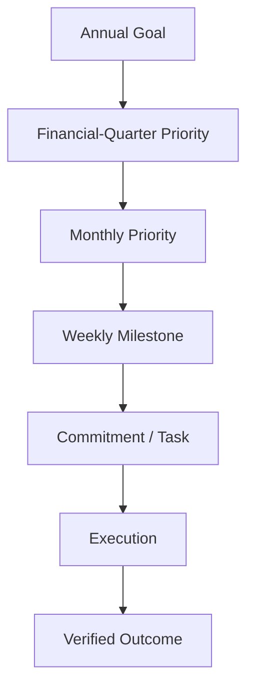
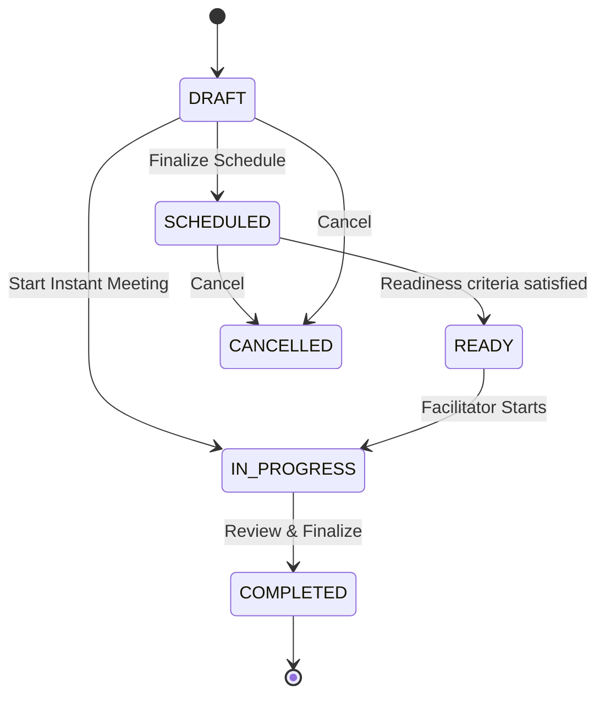
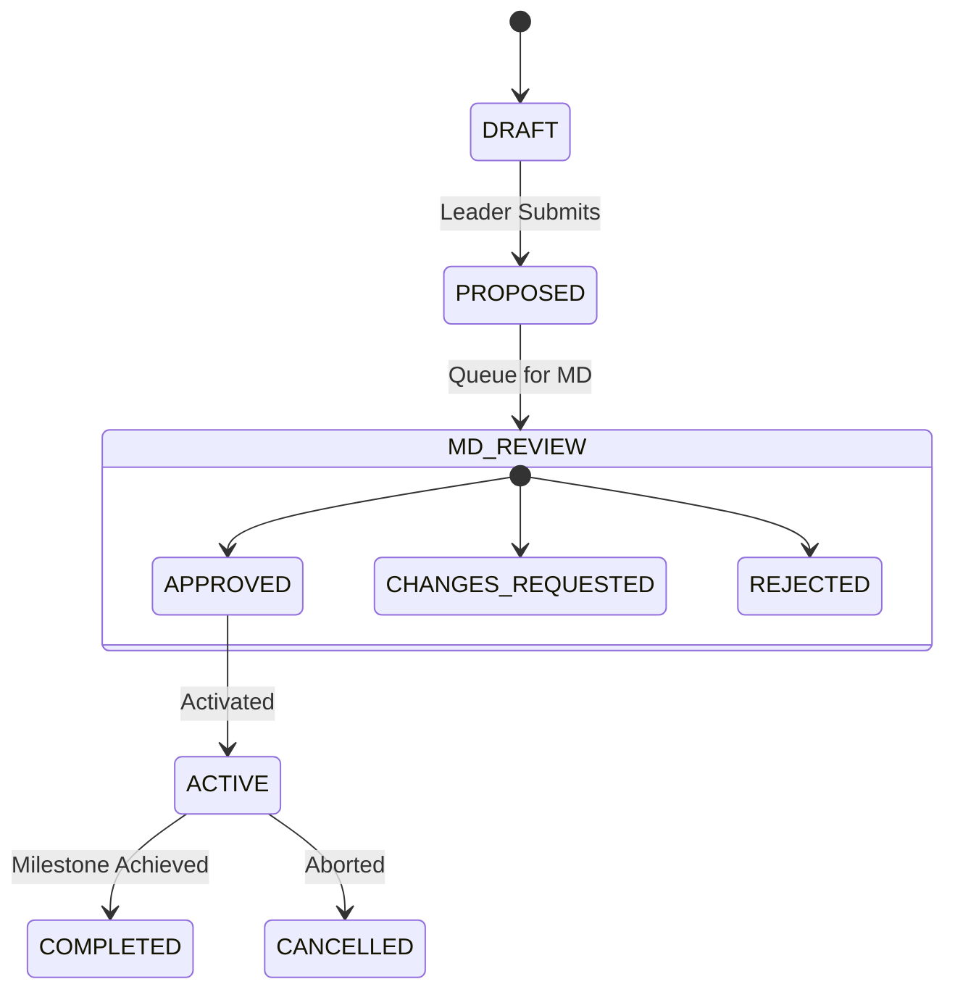
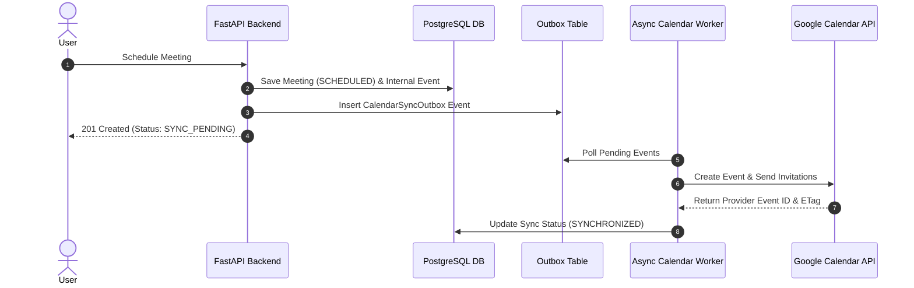

# LAKSHYA — Meeting, Strategy, KPI, O&O and Calendar Redevelopment (V1 Specification)

**Document Version:** 1.0 Draft (Proposed Specification)  
**Status:** Awaiting Product Owner (Het Bhatt) Confirmation  
**Implementation Gate:** Specification review report (PHASE_0_APPROVAL_REVIEW.md) submitted. Implementation phases 1-9 remain pending formal Product Owner sign-off.  
**Target Environment:** Stavya Spine Hospital — MD Office & Leadership  
**Authoritative Backend:** FastAPI, PostgreSQL, Alembic, Scoped RBAC, Audit Engine  
**Product Owner:** Het Bhatt  

---

## 1. Executive Vision & Core Philosophy

LAKSHYA is an automation-first **Management Operating System** designed for Stavya Spine Hospital. It converts strategic organizational goals, meeting decisions, KPIs, leadership instructions, and operational obstacles into structured execution, accountability, and measurable outcomes.



### Supporting Pipelines
* **Meeting Pipeline:** $\text{Meeting} \rightarrow \text{Decision} \rightarrow \text{Action} \rightarrow \text{Task}$
* **Escalation Pipeline:** $\text{Issue} \rightarrow \text{Stuck/Need} \rightarrow \text{Escalation} \rightarrow \text{Resolution}$
* **O&O Pipeline:** $\text{Obstacle / Opportunity} \rightarrow \text{Review} \rightarrow \text{Action} \rightarrow \text{Resolution / Implementation}$

---

## 2. Approved Product Definitions

### 2.1 O&O (Obstacle and Opportunity)
A first-class organizational object capturing operational bottlenecks (Obstacles) or strategic improvements (Opportunities) raised during meetings or daily work.

### 2.2 Financial Quarter Priorities & MD Approval Rules
* Follows the **Indian Financial Year** (1 April to 31 March).
* Leaders may propose Quarterly Priorities.
* **Only the MD may approve** Quarterly Priorities.
* Approved Quarterly Priorities link downstream to Monthly Priorities and Weekly Milestones.

### 2.3 Participant & Organizer Editing Boundaries
* **Participants** may edit ONLY information assigned to them (agenda items, check-ins, assigned milestone updates, assigned KPI values).
* **Organizers** control meeting structure, timing, agenda sequence, and section progression.
* Organizers do NOT automatically gain authority to overwrite another owner's organizational updates.
* **MD approval actions** are strictly restricted to the MD role/permission (`goals.approve`, `priorities.approve`).

### 2.4 Calendar & Synchronization Rules
* **Internal Unified Calendar**: LAKSHYA has its own native calendar rendering scheduled meetings, strategic review dates, milestone reviews, and connected external events.
* **Scheduled Meetings**: Added to the LAKSHYA Calendar and synchronized to external calendars (Google Calendar initial integration). Calendar provider invitations are sent immediately upon successful scheduled meeting creation via a background outbox worker.
* **Instant / Non-Scheduled Meetings**: Start immediately (`IN_PROGRESS`). They **do not** create external calendar events and **do not** send calendar invitations or scheduled reminders.

---

## 3. Financial Year & FinancialPeriod Engine

Quarterly Priorities must adhere strictly to the Indian Financial Year:
* **Financial Year**: 1 April through 31 March (e.g., `FY 2026–27`).
* **Q1**: 1 April – 30 June
* **Q2**: 1 July – 30 September
* **Q3**: 1 October – 31 December
* **Q4**: 1 January – 31 March

### Backend `FinancialPeriod` Domain Policy
* Deterministically computes the financial year and quarter for any given date.
* Returns exact quarter start and end dates; timestamps derived from those dates are stored in UTC while preserving the applicable IANA timezone.
* Accurately calculates leap years (e.g., February 29).
* Validates that Quarterly Priority dates fall within their target financial quarter bounds.
* Enforces backend-only calculations to prevent frontend date manipulation.

---

## 4. Meeting Authority, Types & Lifecycles

### 4.1 Meeting Creation Authority
Meeting creation is restricted by the granular `meetings.create` permission plus organization, department, and resource scope. MD, authorized leaders, and authorized HR/MD Office users are expected personas, but role names alone never grant authority.

### Granular Scoped Permissions
```text
meetings.view
meetings.create
meetings.update
meetings.start
meetings.complete
meetings.cancel
meetings.reopen
meetings.manage_participants
meetings.manage_agenda
meetings.facilitate
goals.view
goals.propose
goals.create
goals.approve
priorities.view
priorities.propose
priorities.approve
milestones.view
milestones.update_assigned
kpis.view
kpis.create
kpis.record_assigned_value
oo.view
oo.create
oo.update_assigned
calendar.view
calendar.manage_own_connections
calendar.manage_organization_integrations
```

Permission keys grant nothing until they are attached to an approved role template or explicit scoped grant. Frontend visibility is not authorization.

### 4.2 Configurable Meeting Domain & Types
1. **Weekly Meeting**
   * Major Executive Review Meeting
   * CFT / Cross-Functional Meeting
2. **1:1 Meeting**
   * Scheduled 1:1 Meeting
   * Instant / Non-scheduled 1:1 Meeting

### 4.3 Explicit Meeting Lifecycle

* **DRAFT**: Draft editable by authorized organizers.
* **SCHEDULED**: Requires valid start time, end time, and timezone. Enqueues outbox event for calendar sync.
* **IN_PROGRESS**: Active live meeting workspace. Auto-saves sections.
* **COMPLETED**: Read-only record. Reopening requires explicit permission (`meetings.reopen`) and an audited reason.
* **CANCELLED**: Requires permission (`meetings.cancel`) and a cancellation reason. Cancels external calendar events.
* **Concurrency**: Optimistic locking via domain entity `version` field.
* `READY` is an explicit backend transition. Its timing or automation rule is not yet approved and must remain configurable rather than assuming a fixed pre-meeting interval.
* No `GET` request may change meeting state.

---

## 5. Meeting Section Workflows

### 5.1 Weekly Meeting Flow (Default)
$$\text{Start} \rightarrow \text{Agenda} \rightarrow \text{Check-in} \rightarrow \text{Headlines} \rightarrow \text{Annual Goal Review} \rightarrow \text{Quarterly Priority Review/Proposal} \rightarrow \text{Monthly Priority Review} \rightarrow \text{Weekly Milestone Tracking} \rightarrow \text{KPI Review/Add} \rightarrow \text{O\&O Review/Add} \rightarrow \text{Meeting Review} \rightarrow \text{Complete}$$

### 5.2 Daily Meeting Flow
$$\text{Start} \rightarrow \text{Agenda} \rightarrow \text{Immediate Headlines} \rightarrow \text{Current Weekly Milestones} \rightarrow \text{KPI Exceptions} \rightarrow \text{O\&O} \rightarrow \text{Complete}$$

### 5.3 Scheduled 1:1 Flow
$$\text{Start} \rightarrow \text{Agenda} \rightarrow \text{Optional Check-in} \rightarrow \text{Relevant Goals/Priorities} \rightarrow \text{Assigned Weekly Milestones} \rightarrow \text{Relevant KPIs} \rightarrow \text{O\&O \& Support} \rightarrow \text{Complete}$$

### 5.4 Instant 1:1 Flow
$$\text{Start Immediately} \rightarrow \text{Participants} \rightarrow \text{Short Agenda} \rightarrow \text{Discussion Notes} \rightarrow \text{Priority/Milestone Context} \rightarrow \text{O\&O} \rightarrow \text{Complete}$$

---

## 6. Detailed Section Business Rules

### 6.1 Agenda
* Items can be added pre-meeting or during live execution.
* Linked to Goals, Priorities, Milestones, KPIs, or O&O items.
* Statuses: `PENDING`, `DISCUSSED`, `DEFERRED`, `COMPLETED`.
* An authorized organizer may explicitly carry a deferred item into a later meeting while preserving provenance. Automatic carry-forward behavior is not yet approved.

### 6.2 Check-in
* Brief operational check-in (Weekly Meetings).
* Attributes: Participant, Confidence/State (1-5), Important Update, Immediate Concern, Support Needed.
* Each participant edits only their own check-in record.

### 6.3 Headlines
* Significant updates: Achievement, Risk, Organizational Update, Patient-Service Concern, Opportunity.
* Information items that may later link to strategic objects.

### 6.4 Annual Goals
* **In-Meeting**: Review progress, health indicators, and connected Quarterly Priorities. Goal creation is disabled in standard operational meetings.
* **Dedicated Context**: Creation is strictly restricted to the Strategy & Annual Planning module by authorized executive users.

### 6.5 Quarterly Priority Proposals & MD Approval

* Proposals created in meetings retain full meeting and agenda provenance.
* MD Review outcomes require audit logging: Proposer, Source Meeting, Reviewed Date, Decision, Reason, Previous Values, New Values.

### 6.6 Monthly Priorities & Weekly Milestones
* Monthly Priority represents expected monthly outcome.
* Weekly Milestones represent measurable weekly results.
* Updates permitted only by assigned owner or authorized manager.

### 6.7 KPI System
* Indicators: Target, Actual, Trend, Warning Threshold, Critical Threshold.
* Values entered manually or calculated via automated backend integration.
* **Rule**: KPI drops below target **do not** trigger automatic stavyan penalties or automatic task assignments. KPI exceptions flag O&O review recommendations for human decision.

### 6.8 O&O (Obstacle and Opportunity)
* **Lifecycle**: `OPEN` → `UNDER_REVIEW` → `APPROVED_FOR_ACTION` → `IN_PROGRESS` → `WAITING`/`BLOCKED` → `RESOLVED`/`IMPLEMENTED` → `VERIFIED` → `CLOSED`.
* Rendered in List and Kanban views with full provenance linking to source meeting and agenda.

---

## 7. LAKSHYA Calendar & Controlled Two-Way Synchronization

### 7.1 LAKSHYA Native Calendar
* Views: Day, Week, Month, Agenda.
* Default Timezone: `Asia/Kolkata`. Backend stores UTC with IANA timezone metadata.
* Distinguishes LAKSHYA Meetings, external events, recurring items, and sync warnings.

### 7.2 Transactional Outbox Pattern for Calendar Sync


### 7.3 Controlled Two-Way Synchronization Matrix

| Field / Attribute | LAKSHYA Authoritative | External Provider Authoritative | Sync Direction |
| :--- | :---: | :---: | :---: |
| Meeting Workflow / State | Yes | No | LAKSHYA $\rightarrow$ Provider |
| Title, Purpose, Agenda | Yes | No | LAKSHYA $\rightarrow$ Provider |
| Strategic Links (Goals, KPIs, O&O) | Yes | No | LAKSHYA Internal |
| Start / End Time & Location | Yes (Default) | Import (With Conflict Rules) | Two-Way Controlled |
| Participant RSVP Status | No | Yes | Provider $\rightarrow$ LAKSHYA |
| Video Conference Link | No | Yes | Provider $\rightarrow$ LAKSHYA |

* External changes to start/end times trigger validation checks against organizer permissions and participant calendar conflicts.
* External events never create or alter LAKSHYA Goals, Priorities, KPIs, or O&O objects.

---

## 8. Primary Navigation & Page Experience Matrix

| Page # | Navigation Hub | Key Features & Functional Scope | Primary Actions |
| :--- | :--- | :--- | :--- |
| **Page 1** | **Login** | Secure authentication, workspace & permission resolution | Sign In, Session Init |
| **Page 2** | **Home** | Executive Overview, Today's Meetings, Milestone/KPI Updates, O&O List, Pending MD Approvals | Quick Schedule, Start Instant, Add O&O |
| **Page 3** | **Calendar** | Day/Week/Month/Agenda views, internal & external events, sync indicators | Schedule, Open Meeting, Filter Views |
| **Page 4** | **Meetings** | Meeting Register (Upcoming, In Progress, Completed, Cancelled) | Schedule Meeting, Start Instant Meeting |
| **Page 5** | **Schedule Meeting**| 10-step wizard: Type, Details, Participants, Time, Recurrence, Agenda, Strategic Context | Schedule & Send Invitations |
| **Page 6** | **Meeting Prep** | Details, Participants, Sync status, Agenda, Related Strategy/KPIs/O&O, Carry-forwards | Start Meeting |
| **Page 7** | **Live Workspace** | Section navigator (Agenda $\rightarrow$ Check-in $\rightarrow$ Strategy $\rightarrow$ KPIs $\rightarrow$ O&O $\rightarrow$ Complete), auto-save | Facilitate & Complete Meeting |
| **Page 8** | **Completed Meeting**| Read-only meeting record, attendance, check-ins, headlines, strategy updates, audit summary | Export Summary, View Provenance |
| **Page 9** | **Strategy** | Connected view: Annual Goals $\rightarrow$ Quarterly Priorities $\rightarrow$ Monthly Priorities $\rightarrow$ Weekly Milestones | Propose Priority, MD Approval |
| **Page 10**| **Performance / KPI**| KPI Dashboard, Target vs Actual, Trends, Manual/Automatic sources, Review history | Add KPI, Record Assigned Value |
| **Page 11**| **O&O Hub** | List & Kanban views, Obstacles vs Opportunities, Business impact, Provenance links | Create O&O, Update Status |
| **Page 12**| **Calendar Settings**| OAuth Provider connections, Sync logs, Active calendars, Re-auth / Disconnect | Connect / Disconnect Provider |

---

## 9. Audit Event Contracts

All domain mutations emit structured, append-only audit log events:

```json
{
  "audit_id": "aud_01HZX8901234567890ABCDEF",
  "actor_id": "usr_md_01",
  "organization_id": "org_stavya_01",
  "action": "priority.approved",
  "entity_type": "quarterly_priority",
  "entity_id": "qp_2026_q1_04",
  "previous_value": { "status": "PROPOSED" },
  "new_value": { "status": "APPROVED", "approved_by": "usr_md_01" },
  "timestamp": "2026-08-26T11:30:00Z",
  "source": "meeting_workspace",
  "correlation_id": "corr_mtg_9981"
}
```

---

## 10. Technical Architecture & Data Model Boundaries

### 10.1 Modular Backend Services (`apps/api/app/modules`)
* **`meeting`**: Meeting engine, templates, agendas, check-ins, headlines, lifecycle management.
* **`calendar`**: Internal calendar, event models, outbox queue, Google Calendar OAuth & API adapter.
* **`strategy`**: Annual Goals, `FinancialPeriod` engine, Quarterly Priorities, Monthly Priorities, Weekly Milestones.
* **`kpi`**: KPI definitions, manual value recording, automated data source interfaces, exception engine.
* **`oo`**: Obstacle & Opportunity engine, Kanban workflow, impact scoring, resolution tracking.
* **`access`**: Granular permission validation (`can(user, permission, resource)`).
* **`audit`**: Append-only audit logger with redaction filters.

### 10.2 Database Schema Migration Plan
Database tables created via Alembic migrations:
* `financial_periods`
* `annual_goals`
* `quarterly_priorities`
* `monthly_priorities`
* `weekly_milestones`
* `meetings`
* `meeting_participants`
* `meeting_agendas`
* `meeting_checkins`
* `meeting_headlines`
* `kpis`
* `kpi_values`
* `o_and_o_items`
* `calendar_events`
* `calendar_sync_outbox`
* `user_calendar_integrations`

---

## 11. Implementation Phasing Strategy

* **Phase 0**: Specification & Architectural Approval (`docs/product/MEETING_CALENDAR_V1.md`) **[THIS SPECIFICATION]**
* **Phase 1**: Integrated Foundation Verification (FastAPI + Next.js integration)
* **Phase 2**: Backend `FinancialPeriod` Policy & Unit Test Suite
* **Phase 3**: LAKSHYA Internal Calendar Engine & Sync Outbox
* **Phase 4**: Core Meeting Shell & Lifecycle Engine
* **Phase 5**: Google Calendar Integration & Two-Way Sync
* **Phase 6**: Live Meeting Section Flow & Participant Editing Security
* **Phase 7**: KPI Engine & O&O Kanban Subsystem
* **Phase 8**: End-to-End Weekly Meeting Vertical Slice Verification
* **Phase 9**: Additional Meeting Templates (Daily, Scheduled 1:1, Instant 1:1, CFT)

---

## 12. Scheduled and Instant Meeting Calendar Contracts

### 12.1 Scheduled Meeting Transaction

1. Validate `meetings.create`, organizational scope, participants, meeting template, start/end time, recurrence, and IANA timezone.
2. Create the LAKSHYA meeting and internal calendar event in one database transaction.
3. Insert a transactional outbox event with a deterministic idempotency key in that same transaction.
4. Commit before contacting an external provider.
5. A background worker creates the provider event and requests immediate provider invitations.
6. Persist provider calendar ID, provider event ID, provider version/etag, last successful sync, and sync status.
7. Show `PENDING`, `SYNCHRONIZED`, `FAILED`, or `CONFLICT` without losing the LAKSHYA meeting when the provider is unavailable.

Retries use bounded backoff and the same idempotency mapping so they cannot create duplicate events or invitations. Rescheduling and cancellation update the existing provider event. Provider calls never run inside the request transaction.

### 12.2 Instant Meeting Exclusion

An instant meeting is created directly as `IN_PROGRESS`, records its actual start time, and retains participants, context, sections, actual end time, audit, and provenance. The backend must prevent it from:

* creating an external calendar event;
* sending a calendar invitation;
* scheduling pre-meeting reminders; or
* entering the scheduled-event outbox flow.

### 12.3 Recurrence

Recurring meetings require a normalized recurrence definition, series identity, occurrence identity, timezone-safe expansion, an exception model for changed/cancelled occurrences, and idempotent provider mapping. The exact supported recurrence patterns and edit-series/edit-occurrence UX require approval before Phase 3 implementation.

---

## 13. Calendar Views, Filters, and Event Identity

The LAKSHYA Calendar provides Day, Week, Month, and Agenda/List views in the organizational timezone (`Asia/Kolkata` initially). It may display:

* scheduled and recurring LAKSHYA meetings;
* connected external events;
* financial-quarter boundaries;
* monthly review periods;
* Weekly Milestone review dates; and
* later, approved deadlines and reminders.

Required filters are My Calendar, Meetings I Created, Meetings I Attend, Department, Meeting Type, Status, Calendar Provider, LAKSHYA Only, and External Only.

The UI must distinguish LAKSHYA meetings, unlinked external events, linked events, recurring events, cancelled events, and synchronization warnings. External events do not automatically become LAKSHYA meetings; an explicit link/create workflow may be approved later.

---

## 14. Google Calendar Provider Contract and Security

Google Calendar is the first external provider and uses OAuth 2.0. A user explicitly connects their account. The integration must:

* request the minimum approved scopes;
* validate OAuth state and use exact approved redirect URIs;
* encrypt refresh tokens at rest and never expose provider tokens to the frontend;
* keep provider identity separate from LAKSHYA identity;
* support disconnect and token revocation;
* exclude tokens, authorization codes, and secrets from application and audit logs;
* store provider calendar/event identity and version metadata;
* use incremental synchronization tokens where supported;
* process provider change notifications and periodically reconcile because notifications may be missed;
* classify transient, permanent, authorization, validation, and conflict failures; and
* surface permanent failures only to authorized users using non-sensitive messages.

The provider-neutral port is:

```text
CalendarProvider
  connect
  disconnect
  list_calendars
  list_events
  create_event
  update_event
  cancel_event
  get_free_busy
  subscribe_to_changes
  refresh_subscription
  reconcile
```

Future adapters may include Microsoft 365, an approved Apple Calendar workflow, CalDAV, ICS export, and ICS subscription/import. Capability discovery is explicit; the system must not imply that all providers support identical behavior.

---

## 15. Controlled Two-Way Synchronization Policy

LAKSHYA remains authoritative for meeting type, purpose, workflow, agenda business records, sections, strategic objects, KPI/O&O records, and organizational approval state. The provider remains authoritative for RSVP status, provider-generated conference links, and provider-specific metadata.

For date, time, and location:

* LAKSHYA-authorized changes synchronize outward.
* External changes are imported as provider observations.
* Before changing a LAKSHYA meeting, an imported change must pass authorization, lifecycle, scope, and conflict validation.
* Conflicts are recorded and resolved explicitly; unrestricted last-write-wins is prohibited.
* External data can never mutate goals, priorities, milestones, KPI definitions, O&O items, meeting sections, or approval state.

Every inbound and outbound operation carries organization, provider connection, entity mapping, correlation, idempotency, and audit provenance.

---

## 16. KPI and O&O Detailed Contracts

### 16.1 KPI Definition and Values

A KPI definition includes name, description, department, owner, accountable leader, measurement frequency, unit, target operator, target value, warning threshold, critical threshold when approved, data source, automatic/manual mode, review meeting, active status, strategic relationships, and audit history. A KPI value includes period, value, source (`MANUAL`, `LAKSHYA_CALCULATED`, or approved external integration), recorder/import job, recorded time, evidence, contextual notes, and correction history.

Only an assigned user or explicitly authorized manager may record a manual value. An automatic KPI still requires a human-approved definition. Exceptions support review and O&O recommendations; they do not silently punish stavyans, reassign work, escalate, or create tasks.

Meeting review shows current value versus target, trend, data freshness, manual/automatic provenance, contextual notes, and review history. Authorized users may create a KPI or record an assigned value without acquiring authority over other KPI records.

### 16.2 Obstacle and Opportunity

An O&O record includes type, title, description, raiser, assigned owner, source department, involved departments, priority, business impact, expected review/completion date, related Annual Goal, Quarterly Priority, Monthly Priority, Weekly Milestone and KPI, source meeting and agenda item, status, outcome, resolution/implementation evidence, verification, and audit history.

Lifecycle transitions are backend-validated and scoped:

```text
OPEN -> UNDER_REVIEW -> APPROVED_FOR_ACTION -> IN_PROGRESS
IN_PROGRESS -> WAITING | BLOCKED | RESOLVED | IMPLEMENTED
RESOLVED | IMPLEMENTED -> VERIFIED -> CLOSED
```

Obstacle outcomes may be Resolved, Accepted Risk, Rejected, or Postponed. Opportunity outcomes may be Implemented, Rejected, Postponed, or—later—converted to an approved initiative. The creator may edit a draft; the assigned owner may update assigned operational information; involved departments may view within scope; and verification/closure require an authorized reviewer. Reopening and cancellation rules require explicit business approval before implementation. List and Kanban views must preserve cross-department visibility rules and provenance.

---

## 17. Field Editing and Completed-Record Rules

Participants may edit only their own check-in and records explicitly assigned to them. Assigned agenda presenters, Weekly Milestone owners, KPI value recorders, and O&O owners may update only permitted fields and transitions. Organizers may manage structure, participants, agenda order, timing, and section progression, but do not inherit authority over another person's organizational update.

Completed meetings are read-only by default. Reopening requires `meetings.reopen`, an audit reason, optimistic concurrency validation, and a documented policy for which fields become editable. Sensitive 1:1 visibility remains an unresolved business decision and must be deny-by-default until approved.

---

## 18. Notifications Boundary

This phase does not design the full LAKSHYA notification system. Immediate calendar-provider invitations for successfully synchronized scheduled meetings are included. Instant meetings are excluded. The domain and outbox event contracts must preserve extension points for later in-app, email, or other approved notifications without coupling meeting creation to a provider.

---

## 19. Audit Coverage

Audit events are append-only and atomic with the applicable LAKSHYA mutation. Coverage includes meeting creation, scheduling, rescheduling, starting, completing, reopening and cancellation; participant and agenda changes; goal review; priority proposal/review/approval/rejection/change request; Monthly Priority and Weekly Milestone updates; KPI definition/value changes; O&O creation and transitions; calendar connection/disconnection; external create/update/cancel; sync failure/recovery; and conflict resolution.

Each event captures actor/system identity, organization, action, entity type/id, previous/new values where applicable, timestamp, source, reason when required, and correlation ID. Passwords, sessions, OAuth tokens, authorization codes, and provider secrets are always redacted and must never appear in audit payloads.

---

## 20. Meeting Hub Reference Translation

The Stavya Meeting Hub is a functional and UX reference for scheduling, agenda handling, rescheduling/cancellation, the live execution board, O&O capture and Kanban, department/cross-department views, decisions, tasks, Stuck items, summaries, reports, and reminder intervals.

LAKSHYA may adapt those user concepts but must not copy the reference system's environment-variable passwords, browser bearer sessions, hardcoded broad role checks, Supabase service-role bypass, manual schema changes, JSON-only critical relationships, request-transaction provider calls, mutating `GET` routes, five-second polling, title-text relationship matching, unrestricted deletion, or silent task generation.

---

## 21. Verification Matrix

Before a phase is complete, tests must cover its applicable rules, including:

* financial-year boundaries, Q1-Q4 calculations, dates, and leap years;
* organization isolation, permission scope, assigned-information editing, and MD-only approval;
* meeting transition validity, completed immutability, and optimistic concurrency;
* scheduled-versus-instant behavior and instant-meeting external-event exclusion;
* outbox retry, invitation idempotency, duplicate prevention, and provider reconciliation;
* OAuth state validation, token encryption/redaction, disconnect/revocation, and failure classification;
* Quarterly Priority date validation and proposal provenance;
* KPI and O&O provenance and allowed transitions; and
* atomic, correctly redacted audit events.

Database integration and migration tests run against real PostgreSQL. Frontend work requires unit/component tests, type checking, a production build, responsive review, accessibility checks, and browser-based workflow verification.

---

## 22. Scope Reconciliation and Explicit Exclusions

This redevelopment intentionally proposes capabilities that the earlier V0.1 documents classified as future work, notably full O&O, KPI foundations, and Google Calendar integration. Product Owner approval of this document authorizes the product-scope change only; architecture and implementation still proceed phase by phase. On approval, the master product scope and affected business-rule/architecture documents must be updated together so they do not contradict this specification.

The following remain excluded unless separately approved: AI meeting transcription, autonomous agents, predictive analytics, advanced KPI intelligence, RCA/5-Why, WhatsApp automation, a mobile application, automatic task assignment from meeting content, and calendar providers beyond the approved adapter work.

---

## 23. Unresolved Decisions Required Before Relevant Implementation

1. Exact meeting-template configuration and required fields per template.
2. The `READY` transition criteria and whether it is manual, scheduled, or derived.
3. Supported recurrence patterns and series/occurrence editing rules.
4. Sensitive 1:1 visibility and export rules.
5. Google OAuth scopes, Google Cloud project ownership, redirect URIs, token-encryption key custody, and default outgoing calendar.
6. External time/location conflict-resolution authority and response-time expectations.
7. KPI frequency semantics, correction/approval rules, and supported source configurations.
8. O&O rejection, cancellation, reopening, verification, and cross-department authority.
9. Calendar and audit retention, provider payload retention, and authorized support visibility.
10. Whether the current schema/model spike is retained, revised through new migrations, or superseded after specification approval.

No unresolved decision may be replaced by an invented frontend default or a role-name comparison.

---

## 24. Definition of Done and Phase Reporting

A phase is complete only when business rules and authorization are documented; migrations, backend validation, audit, frontend workflow, and important tests exist; organization isolation and secret redaction are verified; documentation matches behavior; regressions are not known; and an ordinary authorized user can understand the workflow.

Every phase report must state:

1. what was implemented;
2. what was deliberately excluded;
3. files changed;
4. migrations added;
5. tests and results;
6. security considerations;
7. unresolved decisions; and
8. the recommended next phase.

Phase 0 completes only when this specification is reviewed and explicitly approved by the Product Owner. Approval does not retroactively validate existing code; implementation must be checked against the approved document.
