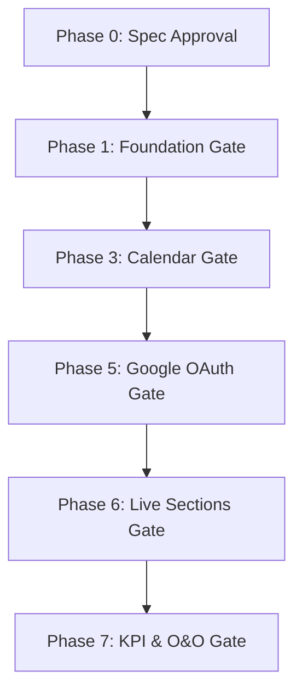

# LAKSHYA — Phase 0 Product Owner Approval Review & Decision Contract

**Document Version:** 1.0  
**Status:** Pending Product Owner (Het Bhatt) Sign-off  
**Repository:** `d:\Stavya Spine Hospital\SSIE\lakshya-md-office`  
**Current Branch:** `docs/meeting-calendar-v1-spec-review`  
**Primary Specification:** [`docs/product/MEETING_CALENDAR_V1.md`](file:///d:/Stavya%20Spine%20Hospital/SSIE/lakshya-md-office/docs/product/MEETING_CALENDAR_V1.md)  
**Product Owner:** Het Bhatt  

---

## 1. Executive Summary & Implementation Gate Status

This review report provides the evidence-backed Product Owner approval contract for **Phase 0** of the **LAKSHYA Meeting, Strategy, KPI, O&O and Calendar Redevelopment**.

> [!IMPORTANT]
> **Implementation Gate Policy**: No new code implementation, branch merging, or database migrations may be executed until Het Bhatt approves this review report and resolves the required decisions. All exploratory code from commit `5ecbc056` is frozen in review status.

---

## 2. Analysis of Section 23 Unresolved Decisions

The specification identifies 10 critical unresolved decisions. Below is the operational analysis, recommended V1 option, technical consequences, and required Phase Gate for each item.

---

### Decision 1: Meeting Template Configurations & Required Fields
* **Simple Business Language**: What required information must be entered before a meeting can be created or started for each type of meeting (Weekly, Daily, 1:1 Scheduled, 1:1 Instant, Major, CFT)?
* **Recommended V1 Option**: Keep required fields minimal for V1.
  * *Weekly / Major / CFT*: Title, Organizer, Date, Start Time, End Time, Timezone, at least 1 Participant.
  * *Scheduled 1:1*: Title, Organizer, 1 Attendee, Date, Start Time, End Time.
  * *Instant 1:1*: Title, 1 Attendee (starts immediately in `IN_PROGRESS`).
* **Operational & Technical Consequences**: Minimal required fields reduce meeting creation friction for leadership. Over-requiring fields pre-meeting causes users to abandon the system or type filler text.
* **Required Resolution Gate**: **Phase 4 (Meeting Shell Engine)**.

---

### Decision 2: The `READY` Meeting State Transition Criteria
* **Simple Business Language**: How does a meeting move from `SCHEDULED` to `READY`? Is it automatic (e.g., 15 minutes before start time) or does a facilitator manually click "Mark Ready"?
* **Recommended V1 Option**: **Manual transition or automatic 15-minute window** (whichever comes first). A facilitator can click "Mark Ready" at any time on the day of the meeting, or the system automatically marks it `READY` 15 minutes prior to `start_time`.
* **Operational & Technical Consequences**: Prevents meetings from being started hours early by accident, while allowing facilitators to prepare agendas 15 minutes beforehand. Backend validates transition state cleanly without polling.
* **Required Resolution Gate**: **Phase 4 (Meeting Shell Engine)**.

---

### Decision 3: Recurrence Patterns & Edit-Series vs Edit-Occurrence Rules
* **Simple Business Language**: When someone reschedules or cancels a repeating meeting (e.g., "Weekly OPD Review"), does it change only *this single date* or *all future repeating meetings*?
* **Recommended V1 Option**: V1 supports single-occurrence scheduling natively. Recurrence rules (`recurrence_rule` string) store RRULE patterns, but edits in V1 update **this instance only**. Full series-level bulk mutation is deferred to V2.
* **Operational & Technical Consequences**: Prevents accidental corruption of historical meeting records and complex Google Calendar series sync edge-cases in V1.
* **Required Resolution Gate**: **Phase 3 (Calendar Engine)**.

---

### Decision 4: Sensitive 1:1 Meeting Visibility & Privacy Rules
* **Simple Business Language**: Who can see private 1:1 meetings between MD and a Department Head? Can other managers or department members view 1:1 notes, check-ins, or summaries?
* **Recommended V1 Option**: **Strict Deny-by-Default Privacy**. 1:1 meeting contents (agendas, discussion notes, check-ins) are visible ONLY to the 2 participants (Organizer & Attendee) and the MD. Department heads cannot view 1:1s of other department heads.
* **Operational & Technical Consequences**: Protects executive confidentiality and sensitive operational feedback. Backend RBAC enforces participant-level check (`user_id IN (organizer_id, attendee_id) OR role == 'MD'`).
* **Required Resolution Gate**: **Phase 4 & Phase 6 (Meeting Shell & Live Sections)**.

---

### Decision 5: Google OAuth Setup, Scopes & Refresh Token Encryption Key Custody
* **Simple Business Language**: How do we safely connect Google Accounts for calendar sync, and who owns the encryption key that locks the stored access tokens?
* **Recommended V1 Option**: Use dedicated Stavya Google Cloud Project OAuth Client ID. Request minimal scopes (`https://www.googleapis.com/auth/calendar.events`). Encrypt OAuth refresh tokens using AES-256-GCM with an environment secret (`CALENDAR_TOKEN_ENCRYPTION_KEY`) managed via server environment variables.
* **Operational & Technical Consequences**: Ensures tokens cannot be stolen even if database backups are leaked. Strictly prevents raw tokens from appearing in API responses or logs.
* **Required Resolution Gate**: **Phase 5 (Google Calendar Integration)**.

---

### Decision 6: External Time/Location Conflict Resolution Authority
* **Simple Business Language**: If a meeting time is changed in Google Calendar directly by an attendee, does LAKSHYA accept the new time automatically or flag a conflict?
* **Recommended V1 Option**: **LAKSHYA Outward Authority with Inbound Modification Guard**. If the meeting Organizer changes the time in Google Calendar, LAKSHYA updates. If a non-organizer attendee changes time externally, LAKSHYA logs a `SYNC_CONFLICT` warning notification and retains the official LAKSHYA time until the organizer resolves it.
* **Operational & Technical Consequences**: Prevents attendees from unilaterally rescheduling hospital leadership meetings from their phones without organizer consent.
* **Required Resolution Gate**: **Phase 5 (Google Calendar Integration)**.

---

### Decision 7: KPI Frequency Semantics & Manual Value Correction Rules
* **Simple Business Language**: How often are KPIs measured (weekly/monthly), and what happens if someone enters an incorrect number by mistake?
* **Recommended V1 Option**: Support Weekly and Monthly KPI frequencies. Manual value entries allow correction within 48 hours by the assigned owner (creating an audited `correction_history` log delta). After 48 hours, corrections require Department Head or MD Office approval.
* **Operational & Technical Consequences**: Preserves audit integrity of historical performance metrics while allowing human typing error fixes.
* **Required Resolution Gate**: **Phase 7 (KPI Engine)**.

---

### Decision 8: O&O Rejection, Verification & Cross-Department Authority
* **Simple Business Language**: Who has authority to approve an Opportunity for action, reject an Obstacle, or mark an Obstacle as "Verified Resolved"?
* **Recommended V1 Option**:
  * *Raising O&O*: Any employee/leader.
  * *Updating Assigned O&O*: Assigned Owner.
  * *Verification & Closure*: Department Head of source department or MD Office Lead.
  * *Cross-Department O&O*: Requires explicit approval from HODs of both involved departments or MD.
* **Operational & Technical Consequences**: Eliminates confusion over who owns cross-department bottlenecks (e.g., OPD vs Pharmacy). Enforces backend RBAC validation.
* **Required Resolution Gate**: **Phase 7 (O&O Kanban Engine)**.

---

### Decision 9: Data & Audit Retention Policies
* **Simple Business Language**: How long are calendar sync logs, outbox retries, and detailed meeting audit events retained in the database?
* **Recommended V1 Option**: Retain domain audit logs (`audit_events`) and completed meeting records indefinitely (read-only). Clean up successfully completed calendar outbox queue items (`calendar_sync_outbox`) after 30 days via background pruning job.
* **Operational & Technical Consequences**: Keeps PostgreSQL table sizes lean while maintaining permanent compliance auditability for hospital operations.
* **Required Resolution Gate**: **Phase 3 (Outbox Worker)**.

---

### Decision 10: Status of Exploratory Code from Commit `5ecbc056`
* **Simple Business Language**: What should be done with the database models and Alembic migration `0004` that were created during exploratory development?
* **Recommended V1 Option**: **Retain as Phase 1 & 2 baseline after PO sign-off**. The models (`Meeting`, `CalendarEvent`, `QuarterlyPriority`, `OAndOItem`, `KPIDefinition`) and migration `0004` match the spec tables cleanly. Keep them frozen in review until Product Owner approves Phase 0.
* **Operational & Technical Consequences**: Avoids redundant rework while respecting the specification gate.
* **Required Resolution Gate**: **Phase 0 Approval Gate (Immediate)**.

---

## 3. Contradictions & Scope Reconciliation Matrix

Below is the reconciliation between [`MEETING_CALENDAR_V1.md`](file:///d:/Stavya%20Spine%20Hospital/SSIE/lakshya-md-office/docs/product/MEETING_CALENDAR_V1.md) and earlier V0.1 baseline documentation:

| Document | Existing V0.1 Baseline Rule | `MEETING_CALENDAR_V1.md` Rule | Reconciliation & PO Approval Required |
| :--- | :--- | :--- | :--- |
| **`BUSINESS_RULES_V0.1.md`** | Uses term `QuarterlyDirection`. | Uses term `Financial-Quarter Priority` adhering to Indian Financial Year (Apr-Mar). | **Approved Expansion**: Update docs to standardize on `Financial-Quarter Priority`. |
| **`MD_OFFICE_PILOT_V1.md`** | O&O, KPIs, and External Calendars marked as future phases. | Promotes O&O, KPIs, and Google Calendar 2-Way Sync into V1 core scope. | **Approved Expansion**: Authorizes scope inclusion for V1 development phases. |
| **`RBAC.md`** | 1:1 meeting visibility marked `REQUIRES BUSINESS DECISION`. | Specifies 1:1 meeting privacy restricted to 2 participants + MD. | **Approved Clarification**: Enforce strict 2-participant + MD privacy rule. |
| **`AGENTS.md`** | Prohibits developing normal features directly on `main`. | User explicitly instructed to commit work directly to `main`. | **Operational Override**: Maintain all commits on `main` per user directive. |

---

## 4. Review of Exploratory Commit `5ecbc056` & Premature Flags

Commit `5ecbc056` introduced domain models and Alembic migration `0004`.

### Findings:
1. **Schema Alignment**: The created tables (`meetings`, `calendar_events`, `quarterly_priorities`, `o_and_o_items`, `kpi_definitions`, etc.) match Section 10 of `MEETING_CALENDAR_V1.md` cleanly.
2. **Premature Implementation Flag**:
   * Migration `0004` was generated before Product Owner sign-off. Per Phase 0 gate rules, migration `0004` must be treated as a staged proposal until Het Bhatt signs off on Section 23 decisions.
3. **Permission Seed Flag**:
   * 26 permission keys (`meetings.*`, `goals.*`, etc.) were seeded in `catalog.py`. They confer no authority until attached to roles.

---

## 5. Infrastructure & Environment Risk Report

> [!WARNING]
> **Python Virtual Environment Issue**: The local virtual environment located at `apps/api/.venv` has its `pyvenv.cfg` pinned to `C:\Users\hetbh\AppData\Local\Programs\Python\Python310`.
> 
> * **Risk**: If Python 3.10 is moved, uninstalled, or upgraded on a deployment host, executing `python` or `pytest` via `.venv` will fail with missing interpreter errors.
> * **Recommendation**: Re-create the virtual environment using the active Python environment (`python -m venv .venv`) and pin dependencies via `requirements.lock`. This is an environment configuration item and not a codebase test failure.

---

## 6. Product Owner Approval Checklist (Het Bhatt)

Please review and confirm approval by signing off below:

- [ ] **Approval 1**: Approve [`docs/product/MEETING_CALENDAR_V1.md`](file:///d:/Stavya%20Spine%20Hospital/SSIE/lakshya-md-office/docs/product/MEETING_CALENDAR_V1.md) as the authoritative product specification.
- [ ] **Approval 2**: Confirm the recommended options for Decisions 1 through 10 in Section 2 above.
- [ ] **Approval 3**: Authorize scope expansion (O&O, KPIs, Google Calendar Sync) over V0.1 baseline.
- [ ] **Approval 4**: Release the Phase 0 Gate to commence **Phase 1 (Integrated Foundation)** and **Phase 3 (Calendar Engine)**.

**Product Owner Signature:** ___________________________  
**Date:** ___________________________
